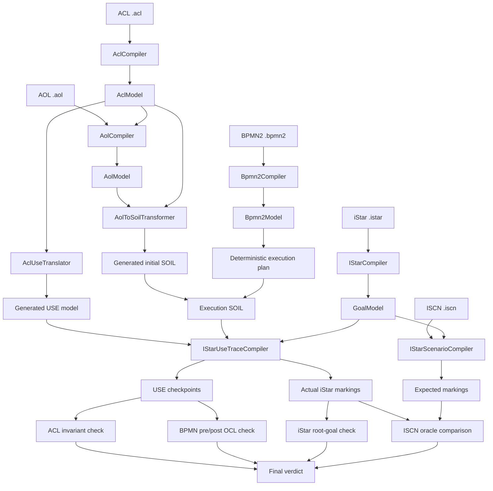
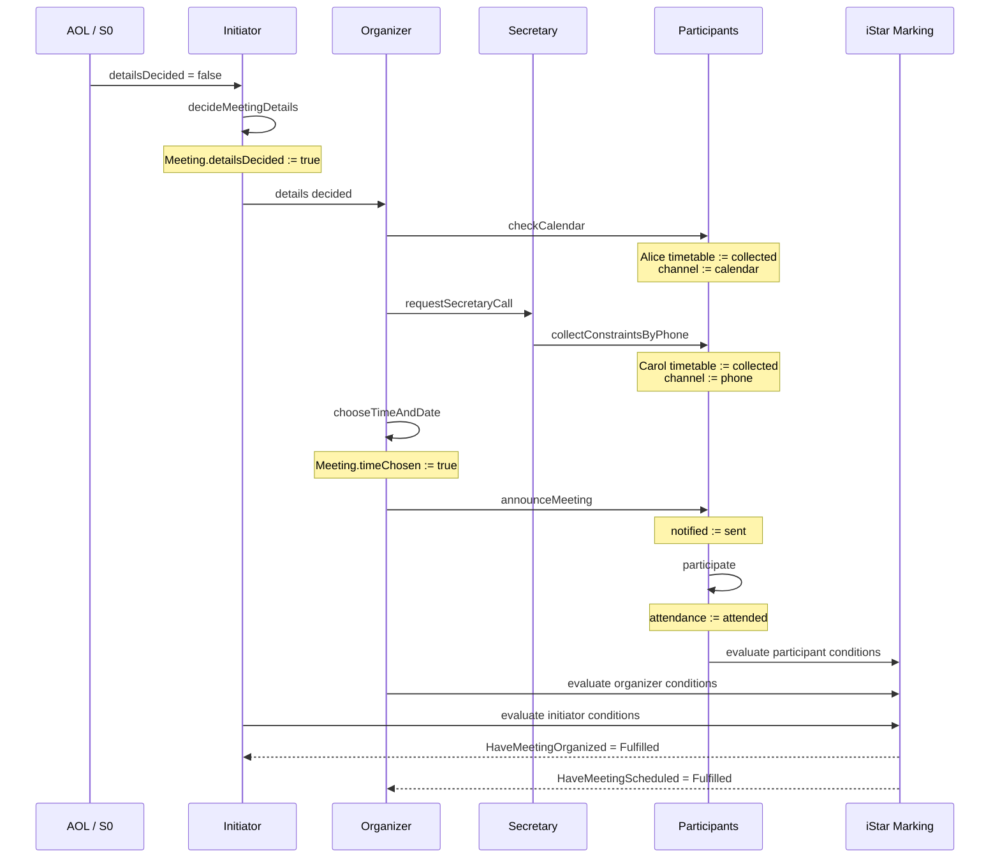

# Complete iStar/BPMN2 Conformance Flow

## 1. Mục đích

Tài liệu này mô tả đầy đủ **complete conformance flow** dùng để kiểm tra sự phù hợp giữa mô hình mục tiêu **iStar** và mô hình quy trình **BPMN2** trên một trạng thái hệ thống chung.

Flow sử dụng năm input:

1. **ACL** — định nghĩa cấu trúc tổ chức và miền trạng thái.
2. **AOL** — mô tả snapshot ban đầu.
3. **iStar** — mô tả goal model, refinement, dependency và OCL goal conditions.
4. **ISCN** — mô tả marking cuối mong đợi cho các actor instance.
5. **BPMN2** — mô tả quy trình, OCL pre/postcondition và SOIL effect.

Câu hỏi cuối cùng là:

> Khi thực thi BPMN2 từ snapshot AOL ban đầu, trạng thái cuối có còn hợp lệ theo ACL, có thỏa các hợp đồng BPMN, có đạt các root goal iStar và có khớp với oracle ISCN hay không?

Flow hiện tại là một **deterministic concrete-trace check**. Nó kiểm tra một execution cụ thể, không phải chứng minh phổ quát cho mọi branch hoặc loop của BPMN.

---

## 2. Định nghĩa conformance trong implementation hiện tại

Conformance không được xác định bằng cách so sánh tên iStar task với tên BPMN task. Hai phía được nối với nhau thông qua **shared USE state**:

- ACL cung cấp vocabulary chung: class, role, entity, attribute, relation và invariant.
- AOL khởi tạo object và giá trị attribute.
- BPMN effect thay đổi các object đó.
- BPMN pre/postcondition được đánh giá trên state trước và sau activity.
- iStar OCL được đánh giá trên cùng state để suy ra marking.
- ISCN mô tả expected final marking và được so sánh với actual marking.

```text
CONFORMANT
⇔ không có lỗi compile/execution
∧ mọi state được chọn hợp lệ theo ACL/USE
∧ mọi BPMN activity pre/postcondition đều đúng
∧ các iStar root goal được kiểm tra đều Fulfilled
∧ final iStar marking khớp ISCN oracle
```



---

## 3. Thành phần điều phối

| Vai trò | Class |
|---|---|
| Orchestrator chính | `org.vnu.sme.goal.conformance.flow.ConformanceFlowRunner` |
| USE plugin action | `org.vnu.sme.goal.conformance.action.ActionRunConformanceFlow` |
| Command-line entry point | `org.vnu.sme.goal.conformance.flow.CompleteConformanceFlowMain` |
| Shared-state checker | `org.vnu.sme.goal.conformance.AclBpmnIStarConformanceChecker` |
| Final oracle comparator | `org.vnu.sme.goal.conformance.oracle.IscnOracleComparator` |
| USE/SOIL trace compiler | `org.vnu.sme.goal.istarusebridge.IStarUseTraceCompiler` |

Các action riêng lẻ chỉ là adapter giao diện. `ConformanceFlowRunner` gọi trực tiếp compiler, transformer và checker để bảo đảm thứ tự domain workflow rõ ràng.

---

# Phần I — Hợp đồng input

## 4. Năm file đầu vào

| Thứ tự | Input | Vai trò | Reference bắt buộc |
|---:|---|---|---|
| 1 | `model.acl` | Structural schema và state space | Không |
| 2 | `snapshot.aol` | Initial concrete snapshot | Phải trỏ tới đúng ACL đã chọn |
| 3 | `model.istar` | Goal model và OCL semantics | Không |
| 4 | `expected.iscn` | Expected instance-level marking | Phải trỏ tới đúng iStar đã chọn |
| 5 | `process.bpmn2` | Process, OCL contracts và effects | Dùng classifier/attribute của ACL |

Runner kiểm tra file tồn tại và đúng extension `.acl`, `.aol`, `.istar`, `.iscn`, `.bpmn2`. AOL và ISCN còn được kiểm tra reference bằng file identity, không chỉ bằng tên file.

---

## 5. ACL — structural schema và state space

ACL định nghĩa **những trạng thái nào có thể tồn tại hợp lệ**.

Trong Meeting Scheduler, ACL định nghĩa:

- Enum: `TimetableStatus`, `TimetableChannel`, `NotificationStatus`, `AttendanceStatus`.
- Entity: `PhoneContact`, `Meeting`.
- Role: `MeetingParty`, `Initiator`, `Organizer`, `Secretary`, `Participant`.
- Group: `MeetingUnit`.
- Relation: `know`, `meetingUnitMeetings`, `phoneContacts`.
- Cardinality: một Initiator, một Organizer, tối đa một Secretary và ít nhất hai Participant.
- Compatibility: Initiator–Participant và Organizer–Secretary có thể do cùng một agent đảm nhiệm trong cùng group.

Các attribute bị BPMN effect thay đổi phải là `mutable`, ví dụ:

```acl
detailsDecided : Boolean mutable;
timeChosen     : Boolean mutable;

timetable        : TimetableStatus mutable;
timetableChannel : TimetableChannel mutable;
notified         : NotificationStatus mutable;
attendance       : AttendanceStatus mutable;
```

ACL không mô tả execution order, transition hoặc goal satisfaction. Nó chỉ định nghĩa schema và invariant cho mọi snapshot.

---

## 6. AOL — initial object snapshot

AOL là object-diagram-style instance snapshot của ACL. Nó xác định:

- Agent cụ thể.
- Group instance.
- Role instance và agent chơi role.
- Entity instance.
- Attribute value ban đầu.
- Relation link giữa các instance.

Trong ví dụ:

```text
Agents:
  alice, bob, carol

Group:
  architectureReview : MeetingUnit

Role instances:
  initiatorAlice   : Initiator   played by alice
  organizerBob     : Organizer   played by bob
  secretaryBob     : Secretary   played by bob
  participantAlice : Participant played by alice
  participantCarol : Participant played by carol
```

Initial state chính:

```text
reviewMeeting.detailsDecided = false
reviewMeeting.timeChosen     = false

participantAlice:
  hasCalendar      = true
  timetable        = requested
  timetableChannel = none
  notified         = notSent
  attendance       = unknown

participantCarol:
  hasCalendar      = false
  timetable        = requested
  timetableChannel = none
  notified         = notSent
  attendance       = unknown
```

Snapshot này bảo đảm mỗi BPMN activity tạo ra một transition thực sự.

---

## 7. iStar — goal model và state semantics

iStar định nghĩa actor, goal, task, quality, refinement, contribution, dependency và OCL pre/postcondition.

Root goal của Initiator:

```text
HaveMeetingOrganized
  AND
  ├─ DecideMeetingDetails
  ├─ HaveSchedulingPerformed
  └─ MeetingAttended
```

Root goal của Organizer:

```text
HaveMeetingScheduled
  AND
  ├─ TimetablesCollected
  ├─ ChooseTimeAndDate
  └─ MeetingAnnounced
```

OCL biến goal/task trừu tượng thành state predicate có thể kiểm tra:

```ocl
DecideMeetingDetails post:
  Meeting.allInstances()->exists(m | m.detailsDecided)
```

```ocl
Participant.Participate post:
  self.attendance = #attended
```

Với parameter refinement, `self` được bind theo concrete role instance, chẳng hạn `participantAlice` hoặc `participantCarol`.

---

## 8. ISCN — expected marking oracle

ISCN không mutate USE state. Nó mô tả:

- Actor instance.
- Goal/task được `fire`.
- Goal/task status được `assign`.
- Quality status.
- Expected partial marking cuối.

Ví dụ:

```iscn
instance initiatorAlice : Initiator;
instance organizerBob : Organizer;
instance secretaryBob : Secretary;
instance participantAlice, participantCarol : Participant;
```

Expected facts tiêu biểu:

```text
participantAlice.CollectFromCalendar = Fulfilled
participantCarol.CollectFromCalendar = Pending
participantAlice.HavePPCalled = Pending
participantCarol.HavePPCalled = Fulfilled
initiatorAlice.HaveMeetingOrganized = Fulfilled
organizerBob.HaveMeetingScheduled = Fulfilled
```

ISCN là **partial oracle**: comparator chỉ kiểm tra element được quan sát bởi `fire`, `assign` hoặc `aggregate`.

---

## 9. BPMN2 — executable process model

BPMN2 mô tả pool, lane, event, activity, sequence flow, precondition, postcondition và effect.

Flow tuyến tính của Meeting Scheduler:

```text
start
→ decideMeetingDetails
→ checkCalendar
→ requestSecretaryCall
→ collectConstraintsByPhone
→ chooseTimeAndDate
→ announceMeeting
→ participate
→ end
```

Mỗi activity có thể có:

```text
precondition  → kiểm tra state trước activity
effect        → mutate shared state
postcondition → kiểm tra state sau activity
```

Effect nên generic theo type/navigation:

```soil
for p in Participant.allInstances() do
  p.notified := #sent;
end
```

không nên phụ thuộc tên object cụ thể của một AOL snapshot.

---

# Phần II — Các stage thực thi

## 10. Stage 0 — input validation

Nếu file không tồn tại hoặc sai extension, flow dừng tại stage tương ứng, trả lỗi và không tạo conformance verdict.

---

## 11. Stage 1 — compile ACL

```text
ACL source
→ lexer/parser
→ concrete syntax model
→ semantic AclModel
→ semantic validation
```

Output stage:

```text
1. ACL schema PASSED MeetingSchedulerShadow
```

Sau đó checker dịch ACL thành USE:

```text
AclModel
→ AclUseTranslator
→ acl-<random>.use
```

Generated USE chứa enum, class, generalization, association, composition, multiplicity và OCL invariant.

Ví dụ:

```use
class Participant < MeetingParty
attributes
  hasCalendar : Boolean
  timetable : TimetableStatus
  timetableChannel : TimetableChannel
  notified : NotificationStatus
  attendance : AttendanceStatus
end
```

Compatibility được chuyển thành các invariant `NoConflict_*` cho những cặp role không được phép cùng tồn tại trong một group instance.

---

## 12. Stage 2 — compile AOL

```text
AOL source
→ AolCompiler
→ resolve ACL
→ validate snapshot against AclModel
→ AolModel
```

Validation gồm group/role/entity type, abstract role, agent, instance identity, attribute type, enum value, required attribute, cardinality, compatibility, endpoint type và link multiplicity.

Output stage:

```text
2. AOL snapshot PASSED
MeetingSchedulerInitial -> meeting_scheduler.acl
```

---

## 13. Stage 3 — compile iStar

```text
iStar source
→ IStarCompiler
→ GoalModel
→ semantic validation
```

Validation gồm uniqueness, refinement consistency, acyclic graph, parameter actor type, contribution, dependency endpoint và dependum kind.

Output stage:

```text
3. iStar goal model PASSED MeetingScheduler
```

---

## 14. Stage 4 — compile ISCN

```text
ISCN source
→ resolve iStar
→ instantiate actor instances
→ instantiate goal graph
→ execute fire/assign
→ saturation/parameter aggregation
→ expected markings
```

Output stage:

```text
4. ISCN oracle PASSED MeetingSchedulerExpected
```

### Instance binding khi so sánh oracle

1. Exact AOL role-instance ID.
2. Nếu không có, AOL agent ID được chấp nhận khi chỉ resolve tới một role instance phù hợp.
3. Nếu một agent có nhiều matching role instance, binding là ambiguous.

Ví dụ dùng exact IDs: `initiatorAlice`, `organizerBob`, `secretaryBob`, `participantAlice`, `participantCarol`.

---

## 15. Stage 5 — compile BPMN2

```text
BPMN2 source
→ Bpmn2Compiler
→ Bpmn2Model
→ structural/semantic validation
```

Output stage:

```text
5. BPMN2 + OCL PASSED MeetingScheduler
```

Semantic model chứa `Process`, `Lane`, `Activity`, `Event`, `SequenceFlow`, `ActivityConstraint` và `effectSource`.

---

## 16. Stage 6A — AOL thành initial SOIL

Runner gọi:

```text
AolToSoilTransformer.transform(AclModel, AolModel)
```

Artifact:

```text
aol-initial-<random>.soil
```

Ví dụ:

```text
C:\Users\Admin\AppData\Local\Temp\
aol-initial-17007778733674631110.soil
```

Nội dung gồm:

```soil
!create alice : Agent
!create participantAlice : Participant
!set participantAlice.timetable := #requested
!set reviewMeeting.detailsDecided := false
!insert (alice, participantAlice) into Agent_plays_Participant
!insert (participantAlice, alicePhone) into phoneContacts
```

Thực thi toàn bộ file tạo initial state `S0`. Đây là generated artifact; muốn thay đổi phải sửa AOL rồi generate lại.

---

## 17. Stage 6B — tạo deterministic execution plan

Checker dựng activity order từ sequence-flow graph, bắt đầu từ StartEvent và dùng indegree/traversal để tạo thứ tự.

Thứ tự hiện tại:

```text
decideMeetingDetails
checkCalendar
requestSecretaryCall
collectConstraintsByPhone
chooseTimeAndDate
announceMeeting
participate
```

`requestSecretaryCall` không có effect nên:

- Vẫn có ActivityStep.
- Precondition vẫn được kiểm tra.
- Không tạo SOIL statement mới.
- Không tạo checkpoint mới.
- `preCheckpoint == postCheckpoint`.

---

## 18. Stage 6C — tạo execution SOIL

Checker nối:

```text
initial SOIL + ordered BPMN effects
```

Artifact:

```text
bpmn-execution-<random>.soil
```

Ví dụ:

```text
C:\Users\Admin\AppData\Local\Temp\
bpmn-execution-643375057209680349.soil
```

Phần effects:

```soil
-- effect of decideMeetingDetails
for m in Meeting.allInstances() do m.detailsDecided := true; end

-- effect of checkCalendar
for p in Participant.allInstances()->select(p | p.hasCalendar) do
  p.timetable := #collected;
  p.timetableChannel := #calendar;
end

-- effect of collectConstraintsByPhone
for p in Participant.allInstances()->select(p | not p.hasCalendar) do
  p.timetable := #collected;
  p.timetableChannel := #phone;
end

-- effect of chooseTimeAndDate
for m in Meeting.allInstances() do m.timeChosen := true; end

-- effect of announceMeeting
for p in Participant.allInstances() do p.notified := #sent; end

-- effect of participate
for p in Participant.allInstances() do p.attendance := #attended; end
```

Mỗi effect được compact thành một physical line vì trace compiler coi mỗi non-comment line là một SOIL statement/checkpoint.

---

## 19. Stage 6D — load USE và execute trace

Checker gọi:

```text
IStarUseTraceCompiler.compile(
  istarFile,
  generatedUse,
  executionSoil
)
```

Trace compiler:

1. Load USE model.
2. Tạo USE system state.
3. Thực thi từng SOIL statement.
4. Lưu checkpoint sau mỗi statement.
5. Đánh giá iStar OCL trên state.
6. Tạo marking cho từng concrete actor/role instance.
7. Propagate marking qua refinement, contribution và dependency.

Một checkpoint chứa về logic:

```text
Checkpoint
├─ USE MSystemState
└─ Map<InstanceKey, IStarMarking>
```

---

# Phần III — Checkpoint và state transition

## 20. Cách đếm checkpoint

Checkpoint được tạo cho mỗi dòng SOIL thực thi, không tính comment và dòng rỗng.

```text
41 initial SOIL statements
+ 6 BPMN effect statements
= 47 checkpoints
```

| Checkpoint | Nguồn | Ý nghĩa |
|---:|---|---|
| 1–41 | AOL-generated SOIL | Tạo dần initial snapshot |
| 41 | Initial checkpoint | AOL snapshot hoàn chỉnh `S0` |
| 42 | `decideMeetingDetails` | `detailsDecided := true` |
| 43 | `checkCalendar` | Thu thập calendar cho Alice |
| 43 | `requestSecretaryCall` | Không effect, dùng cùng state |
| 44 | `collectConstraintsByPhone` | Thu thập phone cho Carol |
| 45 | `chooseTimeAndDate` | `timeChosen := true` |
| 46 | `announceMeeting` | Mọi Participant notified |
| 47 | `participate` | Mọi Participant attended |

---

## 21. State transition của Meeting Scheduler

### S0 — initial AOL state

```text
Meeting:
  detailsDecided = false
  timeChosen = false

Alice:
  timetable = requested
  channel = none
  notified = notSent
  attendance = unknown

Carol:
  timetable = requested
  channel = none
  notified = notSent
  attendance = unknown
```

### S1 — `decideMeetingDetails`

```text
Meeting.detailsDecided: false → true
```

### S2 — `checkCalendar`

```text
participantAlice.timetable: requested → collected
participantAlice.timetableChannel: none → calendar
```

### `requestSecretaryCall`

Không mutate state.

### S3 — `collectConstraintsByPhone`

```text
participantCarol.timetable: requested → collected
participantCarol.timetableChannel: none → phone
```

### S4 — `chooseTimeAndDate`

```text
Meeting.timeChosen: false → true
```

### S5 — `announceMeeting`

```text
participantAlice.notified: notSent → sent
participantCarol.notified: notSent → sent
```

### S6 — `participate`

```text
participantAlice.attendance: unknown → attended
participantCarol.attendance: unknown → attended
```

---

# Phần IV — Bốn lớp kiểm tra

## 22. ACL/USE invariant check

Checker kiểm tra USE constraints tại:

- Initial checkpoint.
- Post-checkpoint của mỗi activity.

Nếu state vi phạm invariant, checker báo checkpoint vi phạm sớm nhất và chi tiết constraint.

Các nhóm điều kiện được bảo vệ:

- Cardinality.
- Association multiplicity.
- Composition.
- Agent-role-group structure.
- Role compatibility.
- General USE model consistency.

Kết quả:

```text
ACL invariants: PASS
```

Điều này nghĩa là BPMN effects không đưa state ra ngoài state space hợp lệ của ACL.

---

## 23. BPMN pre/post OCL check

Với mỗi activity:

```text
precondition  → preCheckpoint
effect        → thay đổi state nếu có
postcondition → postCheckpoint
```

Failure xảy ra nếu OCL không compile, không trả Boolean hoặc trả `false`.

| Activity | Pre | Effect | Post |
|---|---|---|---|
| `decideMeetingDetails` | Có Meeting chưa decided | Set decided | Có Meeting đã decided |
| `checkCalendar` | Details decided và có calendar participant chưa collected | Thu thập calendar | Calendar participant collected qua calendar |
| `requestSecretaryCall` | Có non-calendar participant chưa collected | Không | Không |
| `collectConstraintsByPhone` | Có non-calendar participant chưa collected | Thu thập phone | Non-calendar participant collected qua phone |
| `chooseTimeAndDate` | Details decided và mọi timetable collected | Set timeChosen | Có Meeting timeChosen |
| `announceMeeting` | Có Meeting timeChosen | Set notified | Mọi participant notified |
| `participate` | Mọi participant notified | Set attendance | Mọi participant attended |

Kết quả:

```text
BPMN pre/post OCL: PASS
```

---

## 24. iStar root-goal check

Tại final checkpoint, checker tìm goal không xuất hiện như child của refinement.

Root goals của ví dụ:

```text
Initiator.HaveMeetingOrganized
Organizer.HaveMeetingScheduled
```

Propagation chính:

```text
AND: all children Fulfilled → parent Fulfilled
OR: any child Fulfilled → parent Fulfilled
forall ActorType: all bound child occurrences Fulfilled → parent Fulfilled
pick ActorType: any bound child occurrence Fulfilled → parent Fulfilled
make contribution: element Fulfilled → quality True
```

Final marking quan trọng:

### participantAlice

```text
CollectFromCalendar = Fulfilled
HavePPCalled = Pending
TimetableCollected = Fulfilled
Participate = Fulfilled
MeetingAttendedByParticipant = Fulfilled
QuickScheduling = True
```

### participantCarol

```text
CollectFromCalendar = Pending
HavePPCalled = Fulfilled
TimetableCollected = Fulfilled
Participate = Fulfilled
MeetingAttendedByParticipant = Fulfilled
Inclusivity = True
```

### organizerBob

```text
TimetablesCollected = Fulfilled
ChooseTimeAndDate = Fulfilled
MeetingAnnounced = Fulfilled
HaveMeetingScheduled = Fulfilled
```

### initiatorAlice

```text
DecideMeetingDetails = Fulfilled
HaveSchedulingPerformed = Fulfilled
MeetingAttended = Fulfilled
HaveMeetingOrganized = Fulfilled
```

Kết quả:

```text
iStar root goals: PASS
```

---

## 25. ISCN oracle comparison

Comparator dùng final checkpoint và resolve từng ISCN instance sang actual execution instance.

Với mỗi observed element:

```text
expected status từ ISCN
vs
actual status từ BPMN/OCL trace
```

Failure format:

```text
<instance>.<element>: ISCN=<expected>, BPMN/OCL=<actual>
```

Sau khi dùng unqualified assignment phù hợp cho parameter-refinement fact:

```iscn
assign HaveSchedulingPerformedByOrganizer = Fulfilled;
```

oracle khớp actual marking.

Kết quả:

```text
ISCN oracle: PASS
```

---

# Phần V — Verdict

## 26. `ok()` và `conformant()`

`ok()` nghĩa là flow chạy đủ để tạo kết quả, không có input/compile/runtime error.

`conformant()` yêu cầu:

```text
ok()
AND aclFailures.isEmpty()
AND bpmnFailures.isEmpty()
AND goalFailures.isEmpty()
AND oracleFailures.isEmpty()
```

Meeting Scheduler:

```text
ACL invariants: PASS
BPMN pre/post OCL: PASS
iStar root goals: PASS
ISCN oracle: PASS

VERDICT: CONFORMANT
```

---

# Phần VI — Artifact đầu ra

## 27. Tổng hợp artifact

| Artifact | Sinh từ | Mục đích |
|---|---|---|
| `aol-initial-*.soil` | ACL + AOL | Khởi tạo initial object snapshot |
| `acl-*.use` | ACL | USE class model và invariants |
| `bpmn-execution-*.soil` | Initial SOIL + BPMN effects | Concrete execution trace |
| Runtime checkpoints | USE + execution SOIL | State và marking sau từng statement |
| Conformance result | Bốn lớp check | Failure lists và verdict |
| iStar diagram | Compiled GoalModel | Visualize goal structure |
| BPMN diagram | Compiled Bpmn2Model | Visualize process structure |

Generated temp files phải được regenerate thay vì chỉnh sửa trực tiếp.

---

## 28. Generated initial SOIL

Ví dụ:

```text
C:\Users\Admin\AppData\Local\Temp\
aol-initial-17007778733674631110.soil
```

Chứng minh AOL đã được normalize thành `!create`, `!set`, `!insert` operations.

---

## 29. Generated USE model

Ví dụ:

```text
C:\Users\Admin\AppData\Local\Temp\
acl-14589322042804888568.use
```

Đây là common semantic model mà BPMN OCL và iStar OCL cùng sử dụng. Nếu một OCL expression nhắc classifier hoặc attribute không tồn tại trong generated USE, compile/evaluation sẽ thất bại.

---

## 30. Generated execution SOIL

Ví dụ:

```text
C:\Users\Admin\AppData\Local\Temp\
bpmn-execution-643375057209680349.soil
```

File chứa initial snapshot và toàn bộ ordered BPMN effects. Nó hữu ích để debug activity order, checkpoint mapping và state mutation.

---

## 31. Runtime checkpoints

Checkpoint không được ghi thành 47 file riêng. Chúng tồn tại trong memory dưới dạng `List<Checkpoint>` và được dùng để:

- Kiểm tra ACL invariant.
- Đánh giá BPMN pre/postcondition.
- Tính final iStar root goals.
- So sánh ISCN oracle.

---

# Phần VII — Diagram và UI output

## 32. Complete Conformance Flow UI

`ActionRunConformanceFlow` mở form có năm file selector và nút **Run Complete Flow**.

UI hiển thị:

- `STAGES`: sáu stage và trạng thái PASSED/FAILED.
- `ARTIFACTS`: Initial SOIL, Generated USE, Execution SOIL, checkpoint count.
- Bốn nhóm check.
- Final verdict.
- Scope note.

---

## 33. Diagram tự động mở bởi complete flow

Khi flow chạy thành công về kỹ thuật, `ConformanceFlowForm` tự mở:

### iStar diagram

```text
IStarView.openUseDesktop(...)
```

Hiển thị actor boundary, goal, task, quality, refinement, contribution, dependency, SR/SD view, model browser và specification text.

Complete flow hiện mở plain compiled `GoalModel`; nó chưa tự gắn final conformance badges.

### BPMN diagram

```text
Bpmn2View.openUseDesktop(...)
```

Hiển thị pool, lane, event, task, gateway nếu có, sequence flow và model browser.

Complete flow hiện chưa tự tô từng BPMN task theo PASS/FAIL checkpoint.

---

## 34. Diagram mở qua action riêng

### ACL diagram

```text
ActionOpenAcl → AclView → AclLayoutBuilder → AclDiagram
```

Hiển thị enum, entity, role, group, generalization, association, aggregation, composition, owner và compatibility.

### AOL object diagram

```text
ActionOpenAol → AolView → AolLayoutBuilder → AolDiagram
```

Hiển thị agent, group instance, role/play instance, entity instance, attribute values, links và specification text.

### iStar model diagram

```text
ActionOpenIStar → IStarView
```

Hiển thị plain type-level goal model.

### ISCN scenario diagram

```text
ActionOpenIStarScenario
→ IStarScenarioView.openScenarioDiagram
→ IStarView with badges/label overrides
```

Hiển thị concrete actor instances, qualified goal/task occurrences, Fulfilled/Pending badges, True/False quality badges và expected scenario marking.

### BPMN model diagram

```text
ActionOpenBpmn2 → Bpmn2View
```

Hiển thị process structure độc lập với conformance execution.

---

## 35. USE class diagram và object diagram

Generated `.use` có thể được load trong USE để xem class diagram sinh từ ACL.

Generated `.soil` có thể được thực thi để tạo object state:

```text
acl-*.use → USE class diagram
aol-initial-*.soil → initial object diagram
bpmn-execution-*.soil → evolving/final object state
```

Complete flow hiện chưa tự mở object diagram cho từng checkpoint.

Một nâng cấp UI phù hợp là checkpoint slider:

```text
S0 ─ S1 ─ S2 ─ S3 ─ S4 ─ S5 ─ S6
```

Khi chọn checkpoint có thể hiển thị state diff, BPMN activity tương ứng, iStar badges và OCL failure.

---

## 36. Sequence diagram của Meeting Scheduler



---

# Phần VIII — Diễn giải kết quả Meeting Scheduler

## 37. Vì sao ACL invariants PASS?

- Đủ một Initiator và một Organizer.
- Secretary nằm trong `[0..1]`.
- Có hai Participant, thỏa `[2..*]`.
- Alice chơi Initiator và Participant, là cặp compatible.
- Bob chơi Organizer và Secretary, là cặp compatible.
- BPMN chỉ thay đổi mutable attributes.
- Không effect nào tạo/xóa role hoặc phá association.
- Enum values sau effect đều hợp lệ.

---

## 38. Vì sao BPMN pre/post PASS?

Mỗi effect tạo đúng state mà postcondition yêu cầu:

```text
decideMeetingDetails → detailsDecided = true
checkCalendar → Alice collected by calendar
collectConstraintsByPhone → Carol collected by phone
chooseTimeAndDate → timeChosen = true
announceMeeting → all notified = sent
participate → all attendance = attended
```

---

## 39. Vì sao iStar root goals PASS?

Organizer:

```text
all TimetableCollected
AND ChooseTimeAndDate
AND MeetingAnnounced
→ HaveMeetingScheduled = Fulfilled
```

Initiator:

```text
DecideMeetingDetails
AND HaveSchedulingPerformed
AND MeetingAttended
→ HaveMeetingOrganized = Fulfilled
```

---

## 40. Vì sao ISCN oracle PASS?

| Instance | Element | Expected | Actual |
|---|---|---|---|
| participantAlice | CollectFromCalendar | Fulfilled | Fulfilled |
| participantCarol | CollectFromCalendar | Pending | Pending |
| participantAlice | QuickScheduling | True | True |
| participantAlice | TimetableCollected | Fulfilled | Fulfilled |
| participantCarol | TimetableCollected | Fulfilled | Fulfilled |
| participantAlice | HavePPCalled | Pending | Pending |
| participantCarol | HavePPCalled | Fulfilled | Fulfilled |
| initiatorAlice | HaveMeetingOrganized | Fulfilled | Fulfilled |
| organizerBob | HaveMeetingScheduled | Fulfilled | Fulfilled |

---

# Phần IX — Cách chạy

## 41. Qua USE plugin UI

1. Mở action **Run Complete Conformance Flow**.
2. Chọn đủ năm file.
3. Nhấn **Run Complete Flow**.
4. Xem status từng stage.
5. Xem đường dẫn ba artifact.
6. Xem bốn nhóm PASS/FAIL.
7. Xem verdict.
8. iStar và BPMN diagrams được mở trong USE desktop.

---

## 42. Qua command line

Contract:

```text
CompleteConformanceFlowMain
  model.acl
  snapshot.aol
  model.istar
  expected.iscn
  process.bpmn2
```

```text
usage: CompleteConformanceFlowMain
       model.acl snapshot.aol model.istar expected.iscn process.bpmn2
```

Exit code dự kiến:

```text
0 → CONFORMANT
1 → compile/execution failure hoặc NOT CONFORMANT
2 → sai số lượng argument
```

---

# Phần X — Error model và debug

## 43. Flow failed before verdict

Xảy ra khi file không tồn tại, sai extension, compiler fail, reference sai, USE/SOIL execution fail hoặc không sinh checkpoint.

Khi đó `result.ok() = false`. Đây chưa phải một kết luận nghiệp vụ rằng hai model không conform; flow chưa chạy đủ để tạo verdict.

---

## 44. Flow chạy được nhưng NOT CONFORMANT

Ít nhất một nhóm có failure:

```text
ACL invariants FAIL
hoặc BPMN pre/post OCL FAIL
hoặc iStar root goals FAIL
hoặc ISCN oracle FAIL
```

### Debug ACL failure

Kiểm tra cardinality, association, compatibility, object/link mutation và earliest invalid checkpoint.

### Debug BPMN failure

Kiểm tra preCheckpoint, postCheckpoint, activity effect và OCL expression.

### Debug root-goal failure

Kiểm tra leaf postcondition, AND/OR propagation, `forall`/`pick` binding và dependency.

### Debug ISCN failure

Kiểm tra instance binding, qualified/unqualified statement, expected status, parameter aggregation và observed elements.

---

# Phần XI — Giới hạn implementation hiện tại

## 45. Chỉ kiểm tra một deterministic trace

Verdict không chứng minh mọi branch, mọi loop hoặc mọi interleaving đều conform.

---

## 46. Complete checker chưa dùng token execution engine

Project có `Bpmn2ExecutionEngine` hỗ trợ enabled/running/completed state, gateway routing và guard evaluation. Complete checker hiện dùng `executionOrder(Bpmn2Model)` rồi nối effects.

Vì vậy BPMN concrete example tuyến tính là phù hợp nhất với implementation hiện tại.

---

## 47. Gateway và sequence-flow guard chưa được shared-state checker đánh giá

`evaluateBpmnOcl()` chỉ duyệt ActivityStep. Gateway pre/post và flow guard không tham gia verdict hiện tại.

---

## 48. Effect plan không fail-fast theo precondition

Execution SOIL chứa toàn bộ effects. Nếu precondition false, checker báo BPMN failure nhưng trace vẫn đã chứa các effect phía sau. Verdict vẫn NOT CONFORMANT, nhưng đây chưa phải operational fail-fast execution.

---

## 49. Loop chưa có full execution semantics

Ordering hiện tại không biểu diễn đúng loop count, back edge, repeated execution hoặc data-dependent termination.

---

## 50. ISCN là partial oracle

Element không xuất hiện trong ISCN statement không phải assertion bắt buộc. Oracle chặt hơn nên explicit các root goals, critical intermediate goals và important qualities.

---

## 51. Root goal UNKNOWN

Implementation root-goal check hiện bỏ qua status `UNKNOWN`. Với strong conformance nên coi cả `UNKNOWN` và `PENDING` là failure, chỉ `FULFILLED` mới pass.

---

## 52. Temp artifacts là transient

Ba generated file nằm trong OS temp directory, có thể bị dọn và không nên là source of truth.

Một cải tiến hợp lý là output directory ổn định:

```text
meeting_scheduler.generated.use
meeting_scheduler.initial.soil
meeting_scheduler.execution.soil
meeting_scheduler.conformance.json
meeting_scheduler.report.md
```

---

# Phần XII — Đề xuất output nâng cao

## 53. Machine-readable result

```json
{
  "verdict": "CONFORMANT",
  "scope": "DETERMINISTIC_CONCRETE_TRACE",
  "checkpoints": 47,
  "checks": {
    "aclInvariants": "PASS",
    "bpmnPrePost": "PASS",
    "istarRootGoals": "PASS",
    "iscnOracle": "PASS"
  },
  "artifacts": {
    "generatedUse": "...",
    "initialSoil": "...",
    "executionSoil": "..."
  }
}
```

---

## 54. Human-readable report

Một report chuẩn nên chứa:

- Input path/hash.
- Compiler version.
- Stage status.
- Activity order.
- Checkpoint mapping.
- State diff.
- Root-goal derivation.
- Oracle comparison table.
- Failure details.
- Verdict và scope.

---

## 55. Diagram-enhanced conformance view

Một UI hoàn chỉnh có thể hiển thị đồng thời:

```text
ACL schema diagram
AOL initial object diagram
iStar final marking diagram
BPMN activity result diagram
USE object diagram tại checkpoint được chọn
```

Khi chọn checkpoint:

- Highlight attribute thay đổi.
- Highlight BPMN activity tương ứng.
- Cập nhật iStar status badge.
- Hiển thị failed OCL cạnh node.
- Hiển thị ACL violation trên object/link liên quan.

---

# 56. Tóm tắt

```text
ACL defines valid states.
AOL creates the initial state.
BPMN mutates that state.
BPMN OCL validates activity contracts.
iStar OCL interprets state as goal satisfaction.
ISCN asserts the expected final marking.
The checker combines all results into one verdict.
```

Với Meeting Scheduler:

```text
5 input models compile successfully
→ ACL generates USE schema
→ AOL generates 41-statement initial SOIL
→ BPMN contributes 6 effect statements
→ 47 checkpoints are created
→ ACL invariants pass
→ BPMN pre/postconditions pass
→ iStar root goals are fulfilled
→ ISCN oracle matches
→ VERDICT = CONFORMANT
```

Phạm vi kết luận:

> BPMN MeetingScheduler conform với iStar MeetingScheduler đối với snapshot AOL đã chọn và deterministic concrete execution được complete flow tạo ra.

Kết luận này chưa tương đương với việc mọi execution path của mọi snapshot đều conform. Để đạt mức đó cần token-based execution, branch/loop exploration và universal conformance semantics.
