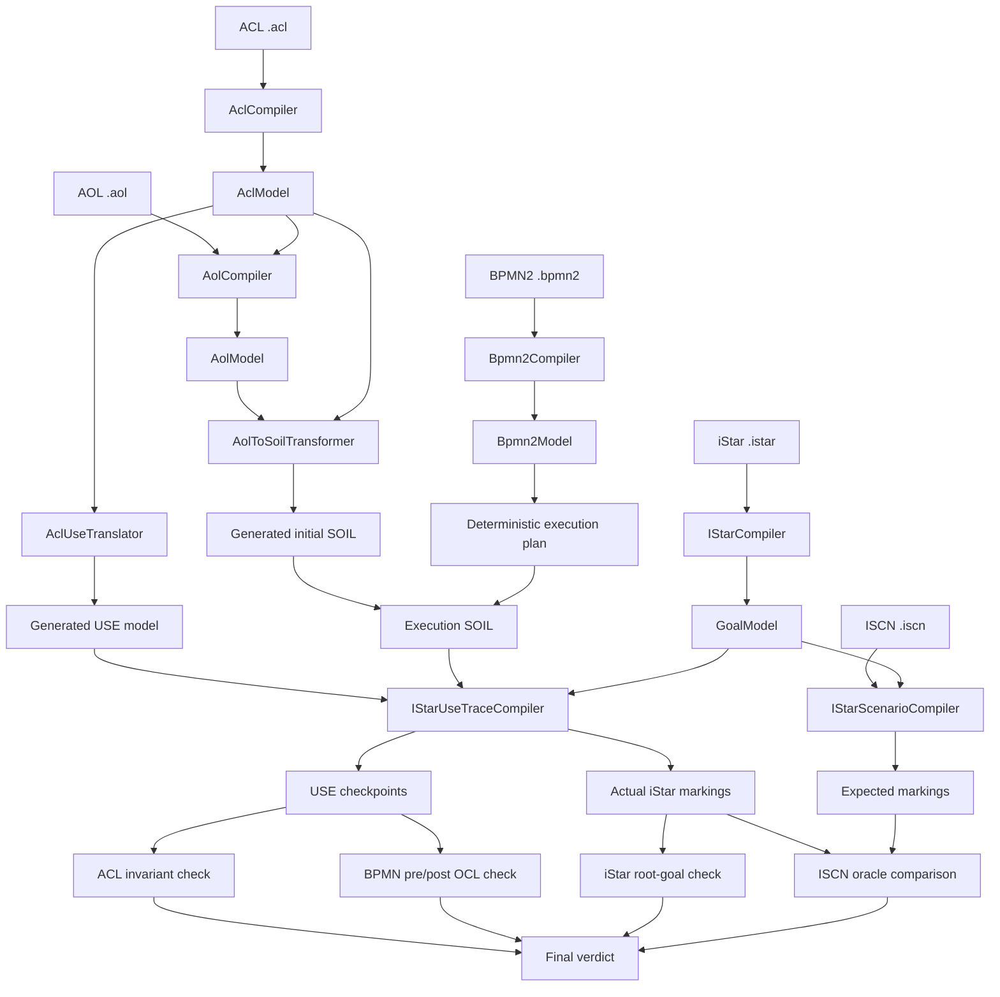
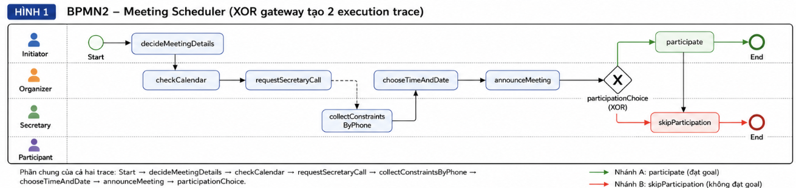
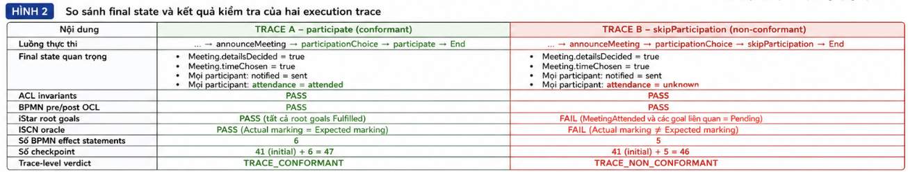
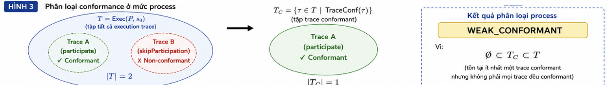

# Complete iStar/BPMN2 Conformance Flow

## 1. Mục đích và phạm vi

Tài liệu mô tả **complete conformance flow** để kiểm tra sự phù hợp giữa mô hình mục tiêu **iStar** và quy trình **BPMN2** trên một trạng thái hệ thống chung:

```text
ACL → AOL → iStar → ISCN → BPMN2 → Shared-State Conformance
```

Flow sử dụng năm input:

| Ký hiệu | Input | Vai trò |
|---|---|---|
|  | ACL | Structural schema, state space và invariants |
|  | AOL | Initial concrete snapshot |
|  | iStar | Goal model và OCL goal semantics |
|  | ISCN | Instance-level scenario và expected marking |
|  | BPMN2 | Process, OCL contracts và state effects |

Bài toán conformance được ký hiệu:

<div align="center">


</div>

Câu hỏi chính:

> Khi thực thi BPMN2 từ snapshot AOL, các state có hợp lệ theo ACL, các activity có thỏa hợp đồng BPMN, các root goal iStar có đạt được và final marking có khớp ISCN oracle hay không?

Implementation hiện tại kiểm tra **một deterministic concrete trace**. Nó chưa chứng minh mọi branch, loop hoặc parallel interleaving của BPMN đều conform.

---

## 2. Nguyên lý shared-state conformance

Conformance không dựa trên việc so sánh tên iStar task với BPMN task. Hai mô hình được nối qua **shared USE state**:

- ACL sinh USE schema và invariants.
- AOL khởi tạo state ban đầu.
- BPMN effects biến đổi state.
- BPMN OCL kiểm tra pre/postcondition trên state trước và sau activity.
- iStar OCL diễn giải cùng state thành goal/task/quality marking.
- ISCN cung cấp expected final marking để so sánh.



### Thành phần chính

| Vai trò | Class |
|---|---|
| Orchestrator | `org.vnu.sme.goal.conformance.flow.ConformanceFlowRunner` |
| Shared-state checker | `org.vnu.sme.goal.conformance.AclBpmnIStarConformanceChecker` |
| ISCN comparator | `org.vnu.sme.goal.conformance.oracle.IscnOracleComparator` |
| USE/SOIL trace compiler | `org.vnu.sme.goal.istarusebridge.IStarUseTraceCompiler` |
| USE plugin action | `org.vnu.sme.goal.conformance.action.ActionRunConformanceFlow` |
| CLI entry point | `org.vnu.sme.goal.conformance.flow.CompleteConformanceFlowMain` |

---

## 3. Hợp đồng input

| Input | Nội dung | Điều kiện chính |
|---|---|---|
| ACL | Classifier, role, group, entity, attribute, relation, cardinality, compatibility | Attribute bị BPMN sửa phải `mutable` |
| AOL | Agent, role instance, entity instance, attribute value và relation link | Phải tham chiếu đúng ACL và tạo state hợp lệ |
| iStar | Actor, goal, task, quality, refinement, contribution, dependency và OCL | Goal graph hợp lệ; OCL dùng classifier của generated USE |
| ISCN | Actor instance, `fire`, `assign`, `aggregate` và expected status | Phải tham chiếu đúng iStar; hiện là partial oracle |
| BPMN2 | Process, activity, event, gateway, sequence flow, pre/postcondition và effect | Effect phải dùng vocabulary từ ACL/generated USE |

ACL xác định tập state hợp lệ và predicate kiểm tra state:

<div align="center">


</div>

AOL tạo initial state:

<div align="center">


</div>

với điều kiện:

<div align="center">


</div>

ISCN cụ thể hóa type-level iStar thành instance-level model và cung cấp observation:

<div align="center">


</div>

Element không thuộc `Obs(C)` không ảnh hưởng oracle verdict.

---

## 4. Execution semantics

### 4.1 Activity transition

Một activity  tạo transition:

<div align="center">


</div>

Transition hợp lệ khi:

1. `Pre_a(s)` đúng.
2. `s' = Eff_a(s)`.
3. `Post_a(s')` đúng.
4. `Valid_A(s')` đúng.

Nếu activity không có effect thì state không đổi. Activity vẫn được kiểm tra pre/postcondition và có thể dùng cùng pre/post checkpoint.

### 4.2 Complete execution trace

<div align="center">


</div>

Trong đó `s0` là AOL state, `ai` là BPMN activity và `sn` là terminal state. Tập complete traces hợp lệ của process là:

<div align="center">


</div>

Complete checker hiện tại chỉ tạo một trace xác định .

### 4.3 Checkpoint

<div align="center">


</div>

Mỗi checkpoint chứa:

- USE system state `si`.
- iStar instance marking `Mi`.

Implementation tạo checkpoint sau mỗi physical SOIL statement. Vì vậy số checkpoint phản ánh số statement thực thi, không nhất thiết bằng số BPMN activity.

---

## 5. iStar marking semantics

### 5.1 Status domain

Goal/Task:

<div align="center">


</div>

Quality:

<div align="center">


</div>

Marking:

<div align="center">


</div>

### 5.2 Leaf và propagation

Một leaf occurrence được `FULFILLED` khi OCL postcondition đúng trên checkpoint state:

<div align="center">


</div>

Các quy tắc propagation chính:

| Quan hệ | Quy tắc |
|---|---|
| AND refinement | Tất cả child `FULFILLED` → parent `FULFILLED` |
| OR refinement | Ít nhất một child `FULFILLED` → parent `FULFILLED` |
| `forall ActorType` | Mọi bound occurrence `FULFILLED` → parent `FULFILLED` |
| `pick ActorType` | Có ít nhất một bound occurrence `FULFILLED` → parent `FULFILLED` |
| `make/help` | Source `FULFILLED` → quality `TRUE` |
| `hurt/break` | Source `FULFILLED` → quality `FALSE` |
| dependency | Dependee dependum `FULFILLED` → depender dependum `FULFILLED` |

Strict semantics coi root `UNKNOWN` hoặc `PENDING` là failure; chỉ `FULFILLED` mới pass.

---

## 6. Complete flow stages

| Stage | Xử lý | Output chính |
|---:|---|---|
| 0 | Validate file, extension và references | Input validation result |
| 1 | Compile ACL và dịch sang USE | `AclModel`, generated `.use` |
| 2 | Compile AOL và transform thành initial SOIL | `AolModel`, initial `.soil` |
| 3 | Compile iStar | `GoalModel` |
| 4 | Compile ISCN và instantiate scenario | Expected markings |
| 5 | Compile BPMN2 | `Bpmn2Model` |
| 6 | Tạo execution plan, nối effects, execute USE/SOIL và tạo checkpoints | Execution trace, markings và check results |

### Deterministic plan hiện tại

Checker duyệt sequence-flow graph từ StartEvent để tạo một activity order. Với Meeting Scheduler:

```text
decideMeetingDetails
→ checkCalendar
→ requestSecretaryCall
→ collectConstraintsByPhone
→ chooseTimeAndDate
→ announceMeeting
→ participate
```

Execution SOIL được tạo bằng:

```text
AOL-generated initial SOIL
+ ordered BPMN effects
```

Effect nên generic theo type/navigation, ví dụ:

```soil
for p in Participant.allInstances() do
  p.notified := #sent;
end
```

thay vì phụ thuộc vào object ID cụ thể của một AOL snapshot.

---

## 7. Bốn lớp conformance của một trace

Với trace :

### 7.1 ACL-state conformance

<div align="center">


</div>

Mọi semantic state được kiểm tra phải thỏa ACL/USE invariants.

### 7.2 BPMN-contract conformance

<div align="center">


</div>

Missing pre/postcondition được xem là `true`.

### 7.3 iStar-goal conformance

<div align="center">


</div>

Strict mode yêu cầu mọi root occurrence đều `FULFILLED`.

### 7.4 ISCN-oracle conformance

<div align="center">


</div>

Comparator chỉ kiểm tra các observed elements trong partial oracle.

---

## 8. Trace verdict và error model

Một concrete trace conform khi cả bốn lớp đều pass:

<div align="center">


</div>

### Verdict phù hợp với implementation hiện tại

| Verdict | Ý nghĩa |
|---|---|
| `TRACE_CONFORMANT` | Concrete trace chạy thành công và pass cả bốn lớp |
| `TRACE_NON_CONFORMANT` | Concrete trace chạy được nhưng có ít nhất một lớp fail |
| `EXECUTION_ERROR` | Input, compile, USE/SOIL execution hoặc trace construction lỗi |

`EXECUTION_ERROR` không đồng nghĩa với `TRACE_NON_CONFORMANT`: trường hợp đầu không tạo được kết quả nghiệp vụ; trường hợp sau đã chạy đủ và tìm thấy vi phạm.

Trong code hiện tại:

```text
ok()
⇔ flow chạy đủ để tạo kết quả

conformant()
⇔ ok()
∧ aclFailures.isEmpty()
∧ bpmnFailures.isEmpty()
∧ goalFailures.isEmpty()
∧ oracleFailures.isEmpty()
```

UI có thể tiếp tục hiển thị `CONFORMANT` / `NOT CONFORMANT`, nhưng report formal nên ghi rõ scope là `DETERMINISTIC_CONCRETE_TRACE`.

---

## 9. Process-level conformance

Giả sử:

<div align="center">


</div>

là tập tất cả execution trace hợp lệ của BPMN từ initial state , và:

<div align="center">


</div>

là tập các trace conformant.

### Weak Conformance

Weak Conformance nghĩa là:

> Tồn tại ít nhất một execution trace của BPMN thỏa toàn bộ yêu cầu conformance.

<div align="center">


</div>

Ví dụ BPMN có hai nhánh:

```text
Branch A → PASS
Branch B → FAIL
```

Khi đó là **WEAK_CONFORMANT**, vì tồn tại ít nhất một execution trace conformant.

---

### Strong Conformance

Strong Conformance nghĩa là:

> Mọi execution trace hợp lệ của BPMN đều thỏa toàn bộ yêu cầu conformance.

<div align="center">


</div>

Ví dụ:

```text
Branch A → PASS
Branch B → PASS
```

Khi đó là **STRONG_CONFORMANT**, vì mọi execution trace đều conformant.

---

### Non-Conformant

Nếu:

```text
Branch A → FAIL
Branch B → FAIL
```

thì:

<div align="center">


</div>

Kết quả là **NON_CONFORMANT**.


### Process verdicts

| Verdict | Điều kiện | Ý nghĩa |
|---|---|---|
| `NON_CONFORMANT` |  | Không có trace nào conform |
| `WEAK_CONFORMANT` |  | Có cả conformant và non-conformant traces |
| `STRONG_CONFORMANT` |  | Mọi trace đều conform |
| `EXECUTION_ERROR` | Không xây dựng được execution space hoặc `T` rỗng do model/execution malformed | Không dùng vacuous truth để kết luận strong |

Implementation hiện tại chưa xây dựng đầy đủ `Exec(P,s0)`, do đó chỉ được kết luận trace-level conformance. Nếu chứng minh process tuyến tính có đúng một complete execution thì `TRACE_CONFORMANT` đồng thời suy ra `STRONG_CONFORMANT` cho snapshot đó.

### Stability

Stability là trục độc lập với weak/strong path quantification:

<div align="center">


</div>

Không nên dùng từ “strong” đồng thời cho universal-path semantics và stable-satisfaction semantics.

---


## 10. Meeting Scheduler — ví dụ Weak Conformance

Ví dụ này minh họa một BPMN có **hai cách thực thi hợp lệ**:

* Một execution trace đạt toàn bộ goal và oracle.
* Một execution trace kết thúc nhưng không đạt goal tham gia cuộc họp.

Do đó, process là **WEAK_CONFORMANT**: tồn tại ít nhất một cách chạy đúng, nhưng không phải mọi cách chạy đều đúng.

### 10.1 Initial state

Trước khi BPMN bắt đầu, trạng thái chính được khởi tạo từ AOL:

```text
Meeting:
  detailsDecided = false
  timeChosen = false

Alice:
  hasCalendar = true
  timetable = requested
  channel = none
  notified = notSent
  attendance = unknown

Carol:
  hasCalendar = false
  timetable = requested
  channel = none
  notified = notSent
  attendance = unknown
```

ACL yêu cầu Meeting Scheduler có:

* Một Initiator.
* Một Organizer.
* Tối đa một Secretary.
* Ít nhất hai Participant.

Initial state thỏa các constraint này.

---

### 10.2 Phần chung của process

Hai execution trace cùng thực hiện các activity sau:

| Step | Activity                    | State effect                          |
| ---: | --------------------------- | ------------------------------------- |
|   S1 | `decideMeetingDetails`      | `detailsDecided := true`              |
|   S2 | `checkCalendar`             | Alice thu thập timetable qua calendar |
|   S2 | `requestSecretaryCall`      | Không thay đổi state                  |
|   S3 | `collectConstraintsByPhone` | Carol thu thập timetable qua phone    |
|   S4 | `chooseTimeAndDate`         | `timeChosen := true`                  |
|   S5 | `announceMeeting`           | Mọi participant có `notified := sent` |

Sau `announceMeeting`, process đi tới XOR gateway:

```text
participationChoice
```

Gateway tạo hai nhánh:

```text
                              ┌→ participate ────────→ end
announceMeeting → XOR gateway
                              └→ skipParticipation ─→ end
```




---

### 10.3 Execution trace A — tham gia cuộc họp

Trace thứ nhất chọn nhánh `participate`:

```text
start
→ decideMeetingDetails
→ checkCalendar
→ requestSecretaryCall
→ collectConstraintsByPhone
→ chooseTimeAndDate
→ announceMeeting
→ participationChoice
→ participate
→ end
```

Activity `participate` thay đổi state:

```text
participantAlice.attendance: unknown → attended
participantCarol.attendance: unknown → attended
```

Final state quan trọng:

```text
Meeting:
  detailsDecided = true
  timeChosen = true

Alice:
  timetable = collected
  channel = calendar
  notified = sent
  attendance = attended

Carol:
  timetable = collected
  channel = phone
  notified = sent
  attendance = attended
```

Kết quả kiểm tra trace A:

| Conformance layer | Kết quả | Giải thích                                          |
| ----------------- | ------- | --------------------------------------------------- |
| ACL invariants    | PASS    | Final state vẫn hợp lệ theo ACL                     |
| BPMN pre/post OCL | PASS    | Mọi activity contract đều thỏa                      |
| iStar root goals  | PASS    | Các goal tổ chức và tham gia cuộc họp đều Fulfilled |
| ISCN oracle       | PASS    | Actual final marking khớp expected marking          |

Do đó:

```text
Trace A → TRACE_CONFORMANT
```

Theo cách đếm checkpoint hiện tại:

```text
41 initial SOIL statements
+ 6 BPMN effect statements
= 47 checkpoints
```

---

### 10.4 Execution trace B — bỏ qua tham gia

Trace thứ hai chọn nhánh `skipParticipation`:

```text
start
→ decideMeetingDetails
→ checkCalendar
→ requestSecretaryCall
→ collectConstraintsByPhone
→ chooseTimeAndDate
→ announceMeeting
→ participationChoice
→ skipParticipation
→ end
```

`skipParticipation` không có effect, vì vậy attendance không thay đổi:

```text
participantAlice.attendance = unknown
participantCarol.attendance = unknown
```

Final state quan trọng:

```text
Meeting:
  detailsDecided = true
  timeChosen = true

Alice:
  timetable = collected
  channel = calendar
  notified = sent
  attendance = unknown

Carol:
  timetable = collected
  channel = phone
  notified = sent
  attendance = unknown
```

Kết quả kiểm tra trace B:

| Conformance layer | Kết quả | Giải thích                                                                |
| ----------------- | ------- | ------------------------------------------------------------------------- |
| ACL invariants    | PASS    | `unknown` vẫn là giá trị enum hợp lệ                                      |
| BPMN pre/post OCL | PASS    | Nhánh kết thúc hợp lệ và `skipParticipation` không có contract bị vi phạm |
| iStar root goals  | FAIL    | Goal `MeetingAttended` không được Fulfilled                               |
| ISCN oracle       | FAIL    | ISCN mong đợi các participant đã thực hiện `Participate`                  |

Các marking liên quan vẫn chưa đạt:

```text
participantAlice.Participate = Pending
participantCarol.Participate = Pending

participantAlice.MeetingAttendedByParticipant = Pending
participantCarol.MeetingAttendedByParticipant = Pending

initiatorAlice.MeetingAttended = Pending
initiatorAlice.HaveMeetingOrganized = Pending
```

Do đó:

```text
Trace B → TRACE_NON_CONFORMANT
```

Do nhánh này không có effect `participate`, số checkpoint là:

```text
41 initial SOIL statements
+ 5 BPMN effect statements
= 46 checkpoints
```




---

### 10.5 Process-level classification

Tập tất cả complete execution trace của process là:

<div align="center">


</div>

Trong ví dụ này:

```text
T = {
  Trace A: participate,
  Trace B: skipParticipation
}
```

Tập các trace conformant là:

<div align="center">


</div>

Cụ thể:

```text
T_C = {
  Trace A: participate
}
```

Ta có:

```text
Trace A → PASS
Trace B → FAIL
```

Vì tập trace conformant khác rỗng nhưng không chứa toàn bộ execution trace:

<div align="center">


</div>

nên:

<div align="center">


</div>

Process-level verdict là:

```text
WEAK_CONFORMANT
```

Nói cách khác:

> BPMN có ít nhất một cách thực thi đạt toàn bộ yêu cầu conformance, nhưng cũng có một cách thực thi không đạt goal model và ISCN oracle.

Process không phải `STRONG_CONFORMANT`, vì điều kiện sau không đúng:

<div align="center">


</div>



---

### 10.6 Kết luận

```text
Trace A: participate
  → TRACE_CONFORMANT

Trace B: skipParticipation
  → TRACE_NON_CONFORMANT

Process:
  → WEAK_CONFORMANT
```

Ví dụ này cho thấy:

* `TRACE_CONFORMANT` chỉ kết luận cho một execution trace.
* `WEAK_CONFORMANT` yêu cầu khám phá nhiều trace.
* Chỉ cần một trace conformant để process đạt Weak Conformance.
* Muốn đạt `STRONG_CONFORMANT`, mọi complete execution trace đều phải conformant.

> **Implementation note:** checker deterministic hiện tại chỉ đánh giá một execution trace. Để tự động trả `WEAK_CONFORMANT`, checker phải khám phá riêng hai nhánh của XOR gateway, kiểm tra conformance cho từng trace rồi tổng hợp kết quả ở process level.
