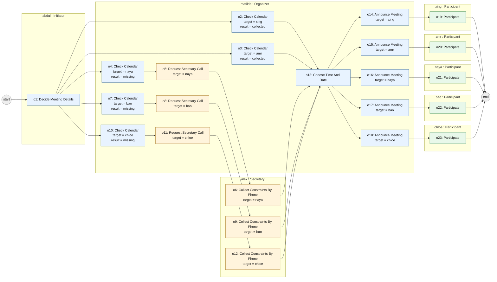

Quy trình này có các loại vai trò:

- Initiator : {Decide Meeting Details}
- Organizer: {Check Participant Calendar, Request Secretary Call, Choose Time And Date, Announce Meeting}
- Secretary: {Collect Constraints By Phone}
- Participant : {Participate}

Quy trình này có các loại bước nghiệp vụ:

- Decide Meeting Details (1)
- Check Participant Calendar  (2a)
- Request Secretary Call2 (3a) -> (3)
- Collect Constraints By Phone  (2b) -> (3)
- Choose Time And Date (3)
- Announce Meeting (4)
- Participate (5)
- End

### Trạng thái khởi tạo

ta có một kich bản:
có abdul là Initiator. Có matilda là Organizer, alex là Secretary. Và các người tham gia là xing, amr ,naya, bao, chloe.

Danh sách những người tham gia là { xing, amr, naya, bao, chloe }

Thông tin khả dụng về calendar:

- `xing.hasCalendar = true`
- `amr.hasCalendar = true`
- `naya.hasCalendar = false`
- `bao.hasCalendar = false`
- `chloe.hasCalendar = false`

Thông tin khả dụng về số điện thoại:

- `alex.canCall(xing) = true`
- `alex.canCall(amr) = true`
- `alex.canCall(naya) = true`
- `alex.canCall(bao) = true`
- `alex.canCall(chloe) = true`


Thế thì ta sẽ chạy như thế nào khi chạy thực tế. ứng với 5 loại quy trình kia.

## Một lần chạy cụ thể từ trạng thái khởi tạo trên

Điểm quan trọng: trong BPMN gốc, các bước như `Check Participant Calendar`,
`Request Secretary Call`, `Announce Meeting`, `Participate` chỉ xuất hiện
một lần như **loại bước**. Nhưng khi chạy với kịch bản này, vì có 5
`Participant` cụ thể, một số bước sẽ sinh ra **nhiều occurrence**, mỗi
occurrence gắn với một người tham gia cụ thể.

Nói cách khác:

- `Announce Meeting` trong BPMN là một activity type.
- Khi chạy với 5 participant, nó có thể sinh ra 5 activity occurrence:
  - `Announce Meeting for xing`
  - `Announce Meeting for amr`
  - `Announce Meeting for naya`
  - `Announce Meeting for bao`
  - `Announce Meeting for chloe`

Tương tự, `Participate` cũng không phải chỉ chạy một lần cho cả nhóm, mà là
một occurrence riêng cho từng participant.

### Bước 1: Initiator quyết định thông tin cuộc họp

Occurrence được tạo:

- `decideMeetingDetails_1 : Decide Meeting Details`

Gắn với:

- performer = `abdul`
- process instance = `meeting1`

Sau bước này, quy trình có đủ thông tin ban đầu để Organizer bắt đầu lên lịch.

### Bước 2: Organizer kiểm tra lịch của từng participant

Vì có 5 participant, bước `Check Participant Calendar` được xét riêng cho
từng người:

- `checkCalendar_xing : Check Participant Calendar`
- `checkCalendar_amr : Check Participant Calendar`
- `checkCalendar_naya : Check Participant Calendar`
- `checkCalendar_bao : Check Participant Calendar`
- `checkCalendar_chloe : Check Participant Calendar`

Gắn với:

- performer = `matilda`
- target participant lần lượt là `xing`, `amr`, `naya`, `bao`, `chloe`

Kết quả dựa trên trạng thái ban đầu:

- `xing.hasCalendar = true` nên lấy được lịch của `xing`
- `amr.hasCalendar = true` nên lấy được lịch của `amr`
- `naya.hasCalendar = false` nên không lấy được lịch trực tiếp
- `bao.hasCalendar = false` nên không lấy được lịch trực tiếp
- `chloe.hasCalendar = false` nên không lấy được lịch trực tiếp

Sau bước này:

- `xing.timetableStatus = collected`
- `amr.timetableStatus = collected`
- `naya.timetableStatus = missing`
- `bao.timetableStatus = missing`
- `chloe.timetableStatus = missing`

### Bước 3a: Với những người không có calendar, Organizer yêu cầu Secretary gọi điện

Vì `naya`, `bao`, `chloe` chưa có lịch, bước `Request Secretary Call` sinh ra
3 occurrence:

- `requestSecretaryCall_naya : Request Secretary Call`
- `requestSecretaryCall_bao : Request Secretary Call`
- `requestSecretaryCall_chloe : Request Secretary Call`

Gắn với:

- performer = `matilda`
- secretary = `alex`
- target participant lần lượt là `naya`, `bao`, `chloe`

Không cần tạo occurrence này cho `xing` và `amr`, vì lịch của họ đã được lấy
trực tiếp từ calendar.

### Bước 3b: Secretary gọi điện để thu thập ràng buộc lịch

Vì `alex` có thể gọi cả 3 người còn thiếu lịch:

- `alex.canCall(naya) = true`
- `alex.canCall(bao) = true`
- `alex.canCall(chloe) = true`

nên bước `Collect Constraints By Phone` sinh ra 3 occurrence:

- `collectByPhone_naya : Collect Constraints By Phone`
- `collectByPhone_bao : Collect Constraints By Phone`
- `collectByPhone_chloe : Collect Constraints By Phone`

Gắn với:

- performer = `alex`
- target participant lần lượt là `naya`, `bao`, `chloe`

Sau bước này:

- `naya.timetableStatus = collected`
- `bao.timetableStatus = collected`
- `chloe.timetableStatus = collected`

Tại thời điểm này, tất cả 5 participant đều đã có lịch:

- `xing.timetableStatus = collected`
- `amr.timetableStatus = collected`
- `naya.timetableStatus = collected`
- `bao.timetableStatus = collected`
- `chloe.timetableStatus = collected`

### Bước 4: Organizer chọn ngày giờ họp

Khi lịch của cả 5 participant đã được thu thập, Organizer thực hiện:

- `chooseTimeAndDate_1 : Choose Time And Date`

Gắn với:

- performer = `matilda`
- input = lịch của `{ xing, amr, naya, bao, chloe }`

Sau bước này:

- `meeting1.timeAndDateStatus = chosen`

### Bước 5: Organizer gửi thông báo họp cho từng participant

BPMN chỉ có một activity type là `Announce Meeting`, nhưng trong kịch bản có
5 participant, nên activity này chạy thành 5 occurrence:

- `announceMeeting_xing : Announce Meeting`
- `announceMeeting_amr : Announce Meeting`
- `announceMeeting_naya : Announce Meeting`
- `announceMeeting_bao : Announce Meeting`
- `announceMeeting_chloe : Announce Meeting`

Gắn với:

- performer = `matilda`
- target participant lần lượt là `xing`, `amr`, `naya`, `bao`, `chloe`

Sau bước này:

- `xing.notified = true`
- `amr.notified = true`
- `naya.notified = true`
- `bao.notified = true`
- `chloe.notified = true`

Đây là chỗ thể hiện rõ nhất sự khác nhau giữa BPMN type-level và scenario
instance-level: **một bước trong BPMN có thể tương ứng với n occurrence trong
kịch bản**, nếu trạng thái có n object cần xử lý.

### Bước 6: Mỗi participant tham gia cuộc họp

Sau khi được thông báo, mỗi participant có một occurrence riêng của bước
`Participate`:

- `participate_xing : Participate`
- `participate_amr : Participate`
- `participate_naya : Participate`
- `participate_bao : Participate`
- `participate_chloe : Participate`

Gắn với:

- performer lần lượt là `xing`, `amr`, `naya`, `bao`, `chloe`
- process instance = `meeting1`

Sau bước này:

- `xing.attended = true`
- `amr.attended = true`
- `naya.attended = true`
- `bao.attended = true`
- `chloe.attended = true`

### Bước 7: Quy trình kết thúc

Quy trình `meeting1` có thể kết thúc khi:

- thông tin cuộc họp đã được quyết định
- lịch của tất cả participant đã được thu thập
- ngày giờ họp đã được chọn
- thông báo đã được gửi cho tất cả participant
- tất cả participant đã tham gia

Trạng thái cuối:

- `meeting1.status = completed`

## Tóm tắt số occurrence phát sinh trong kịch bản này

Với 5 participant `{ xing, amr, naya, bao, chloe }`, một lần chạy cụ thể có
thể sinh ra các occurrence như sau:

| Activity type trong BPMN | Số occurrence trong kịch bản | Lý do |
|---|---:|---|
| Decide Meeting Details | 1 | Gắn với một meeting instance |
| Check Participant Calendar | 5 | Kiểm tra riêng từng participant |
| Request Secretary Call | 3 | Chỉ chạy cho participant không có calendar |
| Collect Constraints By Phone | 3 | Secretary gọi cho 3 participant còn thiếu lịch |
| Choose Time And Date | 1 | Chọn một ngày giờ chung cho meeting |
| Announce Meeting | 5 | Gửi thông báo riêng cho từng participant |
| Participate | 5 | Mỗi participant tham gia riêng |

Vì vậy, nếu muốn xem “quy trình chạy như thế nào” trong kịch bản này, ta
không chỉ nhìn BPMN schema. Ta cần nhìn **các occurrence được sinh ra từ BPMN
schema trên tập object cụ thể của scenario**.

Nói ngắn gọn:

- BPMN nói: có activity type `Announce Meeting`.
- Scenario nói: trong trạng thái này có 5 participant.
- Execution nói: `Announce Meeting` được instantiate thành 5 occurrence,
  mỗi occurrence gửi cho một participant cụ thể.

## Cuối cùng: quy trình đang chạy theo kịch bản nào?

Quy trình không chạy theo BPMN một cách "trống rỗng". BPMN chỉ nói rằng
**loại quy trình** `Meeting Organization` có những bước nào và quan hệ giữa
các bước ra sao. Khi đưa vào một không gian trạng thái cụ thể, quy trình sẽ
chạy theo **kịch bản được sinh ra từ trạng thái đó**.

Với trạng thái khởi tạo ở trên, kịch bản chạy cụ thể là:

> `MeetingOrganization_WithFiveParticipants_MixedCalendarAndPhoneCollection`

Tên này có nghĩa:

- có một process instance: `meeting1`
- có 5 participant: `xing`, `amr`, `naya`, `bao`, `chloe`
- có 2 participant có calendar trực tiếp: `xing`, `amr`
- có 3 participant không có calendar: `naya`, `bao`, `chloe`
- secretary `alex` có thể gọi điện cho cả 3 người còn thiếu lịch
- sau khi có đủ lịch, organizer `matilda` chọn ngày giờ
- sau đó thông báo được gửi riêng cho cả 5 participant
- cuối cùng mỗi participant có một occurrence riêng của bước `Participate`

Nói dưới dạng các nhánh chạy:

```text
meeting1 : MeetingOrganization

1. abdul thực hiện:
   Decide Meeting Details

2. matilda xử lý lịch theo từng participant:
   xing  -> Check Participant Calendar -> collected
   amr   -> Check Participant Calendar -> collected
   naya  -> Check Participant Calendar -> missing -> Request Secretary Call -> alex calls -> collected
   bao   -> Check Participant Calendar -> missing -> Request Secretary Call -> alex calls -> collected
   chloe -> Check Participant Calendar -> missing -> Request Secretary Call -> alex calls -> collected

3. matilda thực hiện:
   Choose Time And Date

4. matilda gửi thông báo:
   Announce Meeting for xing
   Announce Meeting for amr
   Announce Meeting for naya
   Announce Meeting for bao
   Announce Meeting for chloe

5. từng participant tham gia:
   Participate by xing
   Participate by amr
   Participate by naya
   Participate by bao
   Participate by chloe

6. meeting1 kết thúc.

## Biểu đồ execution cho kịch bản hiện tại

Biểu đồ dưới đây không phải là BPMN schema. Nó là **execution view** của một
kịch bản cụ thể. Mỗi node là một occurrence được sinh ra khi process
`meeting1` chạy trên tập object `{ xing, amr, naya, bao, chloe }`.



Điểm cần nhìn trong biểu đồ:

- `Check Calendar` có 5 occurrence vì có 5 participant.
- `Request Secretary Call` chỉ có 3 occurrence vì chỉ `naya`, `bao`, `chloe`
  không có calendar.
- `Collect Constraints By Phone` cũng có 3 occurrence, do `alex` gọi cho 3
  người đó.
- `Announce Meeting` có 5 occurrence, mỗi occurrence gửi cho một participant.
- `Participate` có 5 occurrence, mỗi participant tham gia riêng.
```

Vì vậy, với cùng một BPMN `Meeting Organization`, ta có thể có nhiều kịch bản
chạy khác nhau:

### Kịch bản A: tất cả participant đều có calendar

Nếu cả 5 người đều có calendar:

- `Check Participant Calendar` chạy 5 occurrence
- `Request Secretary Call` chạy 0 occurrence
- `Collect Constraints By Phone` chạy 0 occurrence
- `Announce Meeting` chạy 5 occurrence
- `Participate` chạy 5 occurrence

### Kịch bản B: không participant nào có calendar

Nếu cả 5 người đều không có calendar nhưng secretary gọi được cả 5:

- `Check Participant Calendar` chạy 5 occurrence
- `Request Secretary Call` chạy 5 occurrence
- `Collect Constraints By Phone` chạy 5 occurrence
- `Announce Meeting` chạy 5 occurrence
- `Participate` chạy 5 occurrence

### Kịch bản C: kịch bản hiện tại

Với trạng thái ban đầu trong file này:

- `Check Participant Calendar` chạy 5 occurrence
- `Request Secretary Call` chạy 3 occurrence
- `Collect Constraints By Phone` chạy 3 occurrence
- `Choose Time And Date` chạy 1 occurrence
- `Announce Meeting` chạy 5 occurrence
- `Participate` chạy 5 occurrence

Vậy **kịch bản hiện tại** là:

```text
5 participants,
2 collected by calendar,
3 collected by secretary phone call,
5 notified,
5 participate.
```

Đây là kịch bản cụ thể mà quy trình sẽ chạy, được sinh ra từ không gian trạng
thái ban đầu đã khai báo. BPMN chỉ cung cấp khung; chính tập instance và trạng
thái ban đầu quyết định activity nào được instantiate bao nhiêu lần.


 1.  abdul Decide Meeting Details

2. matilda 
   xing  -> Check Participant Calendar 
   amr   -> Check Participant Calendar 
   naya  -> Check Participant Calendar 
        -> Request Secretary Call 
        -> alex calls 
   bao   -> Check Participant Calendar 
        -> Request Secretary Call 
        -> alex calls 
   chloe -> Check Participant Calendar 
        -> Request Secretary Call 
        -> alex calls 

3.  thực hiện:
   matilda Choose Time And Date

4. matilda gửi thông báo:
   Announce Meeting for xing
   Announce Meeting for amr
   Announce Meeting for naya
   Announce Meeting for bao
   Announce Meeting for chloe

5. từng participant tham gia:
   Participate by xing
   Participate by amr
   Participate by naya
   Participate by bao
   Participate by chloe

6. meeting1 kết thúc.
