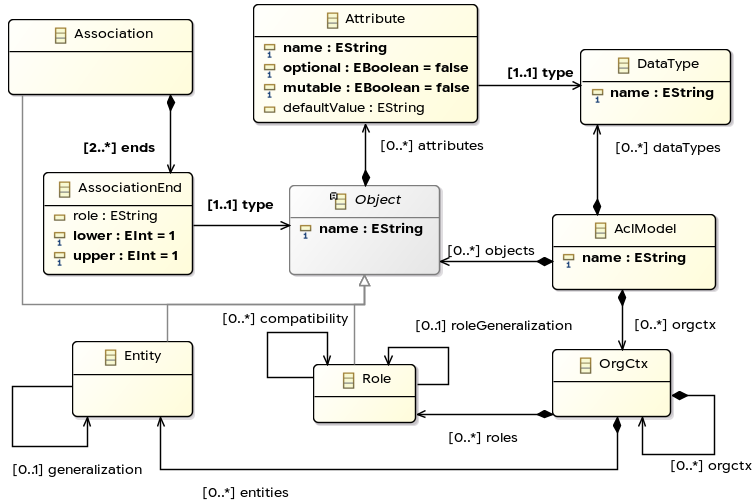
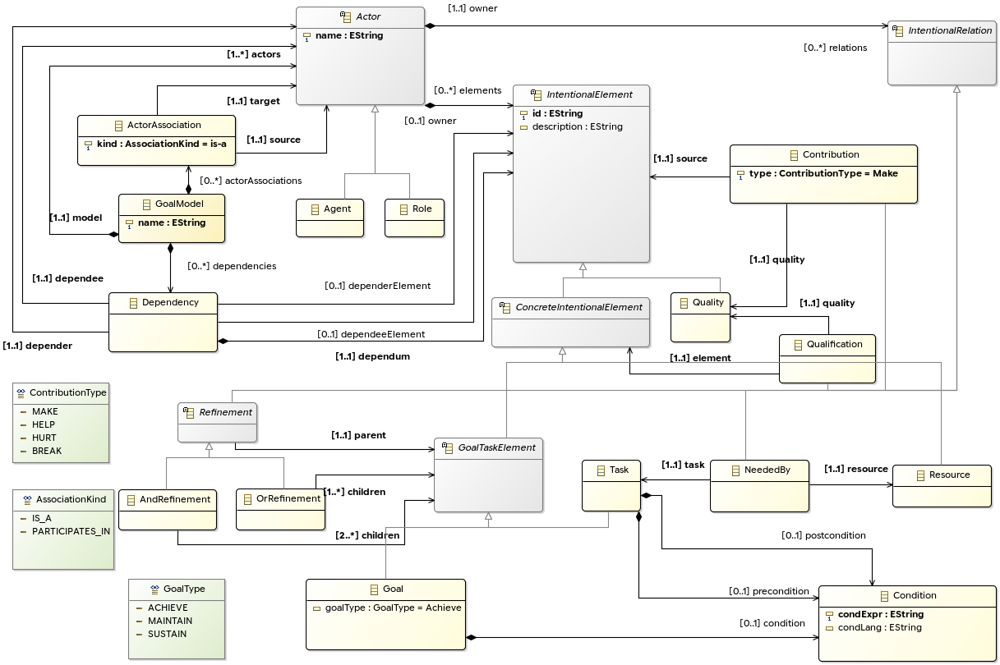
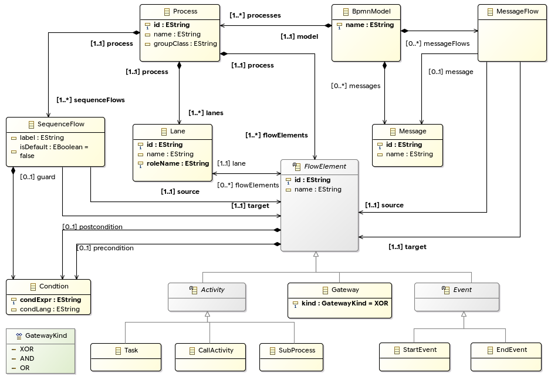

# Installation and Model View Guide

This folder contains the Ecore metamodels for ACL, iStar, and BPMN. The steps
below show how to open their class-diagram views in Eclipse.

## Install the required Eclipse tools

Install **Eclipse Modeling Tools**, then make sure the following components are
available:

- EMF (Eclipse Modeling Framework)
- Sirius
- EcoreTools

You can install missing components from **Help > Eclipse Marketplace** or
**Help > Install New Software**.

## Import and open the models

1. Start Eclipse and select **File > Import**.
2. Choose **General > Existing Projects into Workspace**, then click **Next**.
3. Select the `goal/model` directory from this repository.
4. Clear **Copy projects into workspace** and click **Finish**.
5. Switch to the **Design** perspective.
6. Open **Window > Show View > Other > Sirius > Model Explorer**.
7. Expand one of the `.aird` files and double-click its model representation:

   | File | Model representation |
   |---|---|
   | `acl.aird` | `AclMetamodel` |
   | `istar.aird` | `IstarMetamodel` |
   | `bpmn.aird` | `BpmnMetamodel` |

If a diagram opens without any elements, right-click the canvas and select
**Refresh**. Do not use the **Class** tool simply to make the existing classes
appear, because it creates a new class in the `.ecore` file.

# The Three Modeling Languages

## ACL

ACL describes the structural part of a system, including data types, entities,
groups, roles, attributes, and relationships. Open `acl.ecore` to inspect the
metamodel or `acl.aird` to see its diagram.

## iStar

iStar describes the goals and intentions of system actors. Its model includes
actors, goals, tasks, resources, qualities, refinements, and dependencies. Open
`istar.ecore` or the `IstarMetamodel` representation in `istar.aird`.

## BPMN

BPMN describes system processes and their execution flow through lanes,
activities, gateways, events, and sequence flows. Open `bpmn.ecore` or the
`BpmnMetamodel` representation in `bpmn.aird`.

