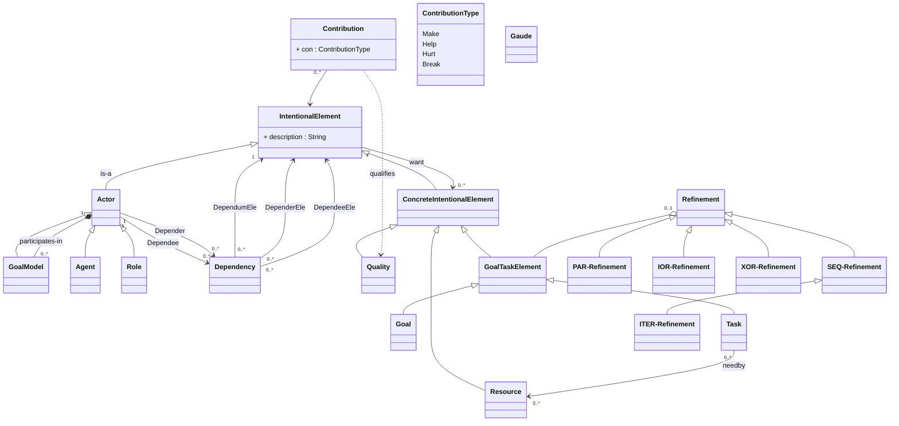

# MAXGoal Metamodel

## Class Diagram

## Ghi chú quan hệ

| Refinement | Quan hệ với GoalTaskElement | Ý nghĩa |
|---|---|---|
| **SeqRefine** | `1 --> 2..*` ordered children | Con thực hiện tuần tự theo thứ tự danh sách |
| **IterRefine** *(extends SeqRefine)* | kế thừa ordered children + `until: String` | Như SEQ nhưng lặp đến khi guard đúng |
| **ParRefine** | `1 --> 2..*` parallel children | Tất cả con thực hiện song song |
| **IorRefine** | `1 *-- 2..* GuardedChild --> 1 GTE` | Một hoặc nhiều nhánh có guard đúng cùng kích hoạt |
| **XorRefine** *(extends IorRefine)* | kế thừa branches + ràng buộc exactly-one | Đúng một nhánh có guard đúng mới kích hoạt |

## Lưu ý thiết kế

- `GoalTaskElement` sở hữu `RefineSpec` (composition `◆`) — một goal/task có **0..1** cách phân rã.
- Mỗi `RefineSpec` tham chiếu đến **con** (cũng là `GoalTaskElement`) bằng tên (`String id`) để hỗ trợ forward reference trong file văn bản `.maxgoal`.
- `GuardedChild` là value object gộp `(condition, childId)` — không phải entity độc lập.
- `ResourceDef` không có refinement; chỉ kết nối qua quan hệ `needby` đến `GoalTaskElement`.
- `Actor` là ranh giới phạm vi — mọi `ConcreteIntentionalElement` đều thuộc đúng một `Actor`.
