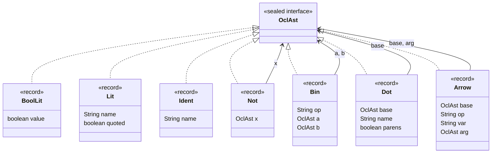
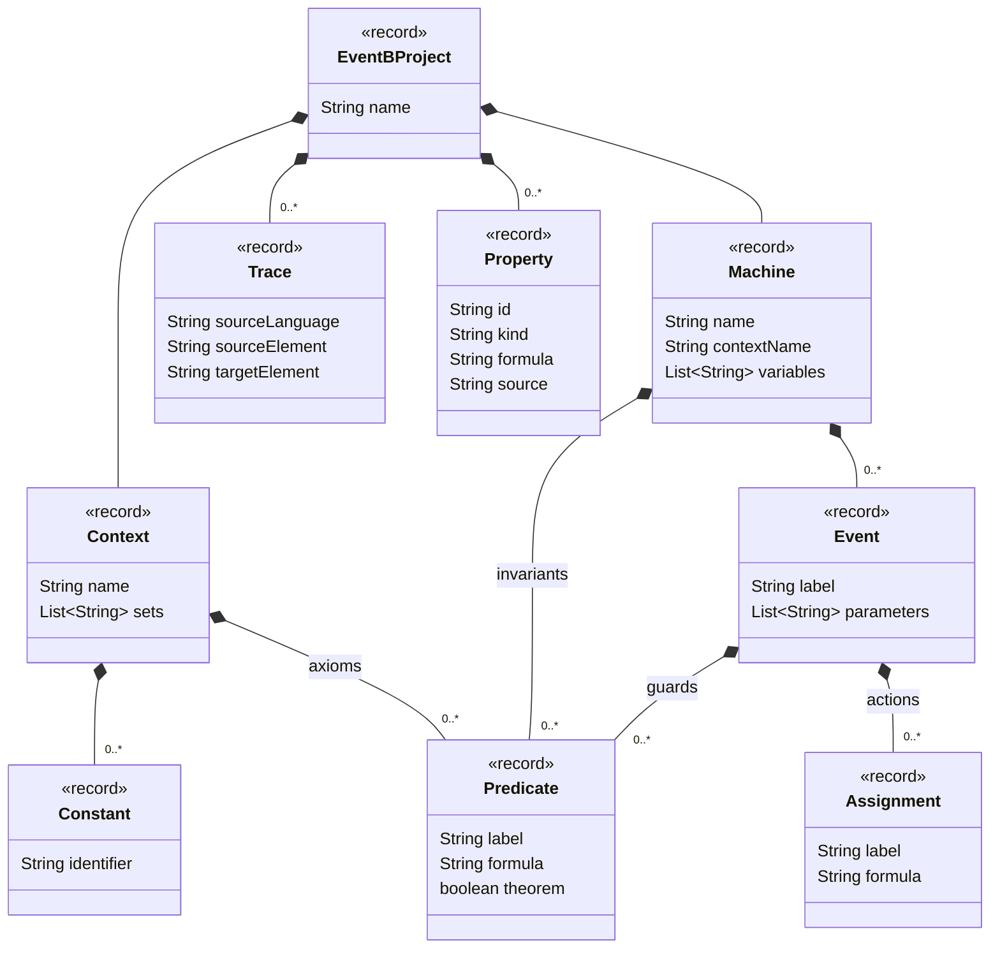
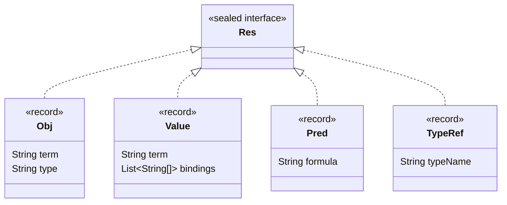

# Cơ sở cho việc dịch OCL sang Event-B

Tài liệu này trả lời một câu hỏi cụ thể: **chưa có nghiên cứu nào công bố "dịch OCL
sang Event-B" như đóng góp chính — vậy dựa vào đâu để tin rằng việc ACL/i*/BPMN +
OCL của dự án này dịch sang Event-B (`acl2eventb.md`, `bpmn2eventb.md`,
`istar2eventb.md`) là có cơ sở, chứ không phải tự chế không kiểm chứng?**

Câu trả lời được ghép từ 2 mảnh **đã có tiền lệ riêng biệt** trong literature, cộng
với bằng chứng thực nghiệm mạnh hơn cả literature: chính bộ luật hiện có của dự án
đã làm việc này và được Rodin tự kiểm qua proof obligation. Mục 1 đặt hai đầu của
phép dịch (metamodel nguồn và đích) cạnh nhau trước, để "luật chuyển" ở các mục
sau có chỗ bám cụ thể thay vì nói chung chung "OCL dịch sang Event-B".

**Trạng thái verify (đọc trước khi trích vào bài báo):** Mục 1 (metamodel + bảng
luật) là verify **cao nhất có thể** — đọc trực tiếp mã nguồn thật của bộ dịch
(`OclAst.java`, `OclParser.java`, `OclToEventB.java`, `ir/EventBProject.java`)
và grammar thật của USE (`use/use-core/target/grammars/OCL.g`), không qua tài
liệu `.md` trung gian nữa. Mục 2 (literature — Ledang&Souquières, Laleau&Mammar)
chỉ verify được ở mức abstract/mô tả từ nhiều search độc lập — đã thử fetch
full-text qua 6 đường link (HAL, academia.edu, ResearchGate, Soton eprints,
SemanticScholar, SciSpace), tất cả đều bị chặn bot (Anubis/403/405). Phần
Snook&Butler (Mục 2.2, 3.2) verify đầy đủ — đọc trọn `umlB.tex` có sẵn trong
repo, chỉ riêng bài ABZ 2008 (Mục 3.2) là chưa có full-text. Trước khi trích
rule chi tiết của 2 bài chưa verify vào main.tex, cần tự truy cập bản đầy đủ —
theo đúng kỷ luật đã đặt ra ở `tutuong.tex` Luật 2.

## 1. Hai đầu của phép dịch: metamodel OCL và metamodel Event-B

**Cập nhật (đã đọc mã nguồn thật):** phần dưới đây ban đầu mô tả OCL ở mức
chuẩn OMG chung chung. Đọc trực tiếp bộ dịch thật của dự án
(`goal/src/main/java/.../aclistarbpmn2eventb/translate/{OclAst,OclParser,
OclToEventB}.java`) cho thấy **luật thực tế nhỏ hơn và cụ thể hơn nhiều** so
với OCL đầy đủ — nội dung dưới đây đã viết lại theo đúng mã nguồn, không còn
suy luận từ spec OMG.

### 1.1. OCL đầy đủ (USE) vs. OCL fragment mà pipeline Event-B chấp nhận

Có **hai tầng OCL khác nhau** trong dự án, không phải một:

- **OCL đầy đủ** — cú pháp thật USE hỗ trợ trong toàn bộ model (dùng cho phần
  checkpoint-trace checking chạy trực tiếp trong USE). Grammar thật:
  `use/use-core/target/grammars/OCL.g` (857 dòng, sinh từ ANTLR). Đối chiếu
  token: có đủ số học (`+ - * /`), so sánh thứ tự (`< > <= >=`), và (theo chuẩn
  OCL nói chung, USE hiện thực đầy đủ) `if-then-else`, `oclIsKindOf`/
  `oclAsType`.
- **OCL fragment mà exporter Event-B thực sự parse** — hẹp hơn nhiều, định
  nghĩa tường minh trong docstring của `OclAst.java`:

  > "booleans, not/and/or/implies, equality, enum/string literals, attribute
  > and shadow-model navigation, and the exists/forAll/select/includes/
  > isEmpty/notEmpty/allInstances/oclIsUndefined collection operations.
  > Anything outside this fragment fails to parse... rather than being
  > approximated."

  Tokenizer của `OclParser.java` xác nhận đúng điều này: chỉ nhận
  `( ) . | = # ->` cộng chữ/số — **không có `+ - * / < > <= >=`, không có
  `if-then-else`, không có `oclIsKindOf`/`oclAsType`**. Một constraint viết
  ngoài fragment này (vd dùng `<` để so sánh số) khiến `OclParser.parse` trả về
  `null` → dừng dịch, không đoán mò (đúng "fail-closed" đã nói ở lượt trước).

  Cây cú pháp (`sealed interface OclAst`, 7 case, không hơn):
  `BoolLit`, `Lit` (enum `#x` hoặc string quoted), `Ident`, `Not`, `Bin`
  (`and`/`or`/`implies`/`=`/`<>`), `Dot` (`base.name` hay `base.name()`),
  `Arrow` (`base->op(...)`, dạng lambda/1-arg/0-arg được phát hiện **theo cấu
  trúc**, không hardcode danh sách operator — nên parser không bao giờ từ chối
  một tên operator nó chưa biết ngữ nghĩa, việc từ chối đó dồn hết xuống bước
  emit).

Vẽ đúng 7 case trên thành class diagram (lấy nguyên tên field từ `OclAst.java`,
không thêm/bớt):



`Not`, `Bin`, `Dot`, `Arrow` tự tham chiếu ngược về `OclAst` (đệ quy) — đây
chính là lý do fragment này, dù chỉ 7 case, vẫn biểu diễn được biểu thức lồng
nhau tuỳ ý (`Coll->select(p|p.hasCalendar)->forAll(...)` là `Arrow(Arrow(...))`
lồng 2 lớp, không cần case riêng cho "biểu thức lồng").

Đây là câu trả lời chính xác cho "metamodel OCL nào liên quan tới bản dịch":
không phải toàn bộ OCL, mà đúng 7 case ở trên.

### 1.2. Metamodel Event-B — theo IR thật của dự án, không phải mô tả sách

`goal/.../aclistarbpmn2eventb/ir/EventBProject.java` (19 dòng) là IR thật mọi
luật dịch phải đổ vào, với chú thích ngay đầu file: *"Small typed IR;
translation code never emits Rodin XML directly."* Nguyên văn cấu trúc:

```java
record EventBProject(name, Context, Machine, List<Trace>, List<Property>)
  record Context(name, sets, constants, axioms: List<Predicate>)
  record Machine(name, contextName, variables, invariants, events: List<Event>)
  record Event(label, parameters, guards: List<Predicate>, actions: List<Assignment>)
  record Assignment(label, formula)
  record Predicate(label, formula, theorem: boolean)
  record Trace(sourceLanguage, sourceElement, targetElement)
  record Property(id, kind, formula, source)
```

So với mô tả Event-B "sách giáo khoa" (Abrial 2010, Mục 3.1 dưới): về cấu trúc
lớn (Context = sets/constants/axioms tĩnh, Machine = variables/invariants/
events động, Event = parameters/guards/actions) là **khớp**. Ba điểm IR này
đơn giản hoá có chủ đích, không phải thiếu sót:

- **Action không phân 3 dạng ở mức kiểu Java** (`:=` / `:∈` / `:|` của GSL) —
  `Assignment` chỉ giữ một `formula` string đã render sẵn; ranh giới 3 dạng
  nằm trong nội dung chuỗi đó, không phải trong cấu trúc Java. Hợp lý vì IR
  này chỉ là điểm trung chuyển trước khi serialize ra Rodin XML thật.
  `Predicate` cũng vậy — không phân biệt `AXIOMS`/`THEOREMS` bằng field
  riêng mà bằng cờ `theorem: boolean` trên cùng một record.
- **Không có `VARIANT`/refinement chain** — dự án không dùng refinement nhiều
  bước, nên Event-B ở đây chỉ có đúng 1 Machine phẳng, không cần biểu diễn
  quan hệ refine.
- **`Trace` và `Property` không thuộc Event-B chuẩn** — đây là phần dự án tự
  thêm: `Trace` là cơ chế truy vết (`_translation.md`, bảng `source element →
  Event-B identifier` đã nhắc ở báo cáo trước); `Property` là chỗ giữ công
  thức LTL (Achieve/Maintain/Sustain/Recur) tách riêng khỏi `invariants` của
  Machine, đúng như phân biệt "PO chứng minh an toàn, LTL/ProB chứng minh
  liveness" đã nói ở Mục 4.

Vẽ IR Event-B thành class diagram (nguyên field từ `EventBProject.java`):



`Trace` và `Property` treo trực tiếp trên `EventBProject`, ngang hàng với
`Context`/`Machine`, không lồng trong chúng — đúng như nhận xét ở trên: đây là
2 record dự án tự thêm cho truy vết/liveness, không phải một phần chuẩn của
Context/Machine Event-B.

### 1.3. Bảng luật thật — OCL fragment (Mục 1.1) → Event-B (Mục 1.2)

Lấy trực tiếp từ `OclToEventB.java` (class `Emitter`, đọc trọn 501 dòng), không
còn qua trung gian tài liệu `.md`. Emitter dùng một kiểu kết quả nội bộ 4 case
(`sealed interface Res`), đây chính là "metamodel cầu nối" thật giữa OCL và
Event-B, cụ thể hơn bảng suy luận trước — vẽ luôn:



`Obj` = tập instance có kiểu ACL (kết quả navigation); `Value` = giá trị vô
hướng dạng tập đơn `{TRUE}`/`{x}` (kết quả literal/so sánh); `Pred` = một
predicate hoàn chỉnh; `TypeRef` = tên lớp chưa resolve, chỉ hợp lệ ngay trước
`.allInstances()`. Bốn case này, không phải bảng OCL→Event-B, mới là nơi
"ý nghĩa" thực sự được phân loại trong lúc dịch: `toPred`/`eval` liên tục ép
kiểu qua lại giữa 4 case này, và một biểu thức chỉ dịch được khi kết quả cuối
cùng rơi đúng vào `Pred` (Mục "Tổng hợp" dưới sẽ dùng lại đúng 4 case này để
bàn về correctness).

| OCL fragment (Mục 1.1) | Event-B | Ghi chú |
|---|---|---|
| `self.a` (`Dot`, không `()`) | `a[{self}]` | attribute image, không phải `a(self)` — lý do WD, Mục 2.2 dưới |
| bare `self.a` làm cả 1 conjunct (không có `= Expr`) | gán `attr ≔ attr  {self ↦ TRUE}` | `emitSelfAssignment`: attribute boolean đọc trần tương đương `= true` |
| `not self.a` làm cả 1 conjunct | gán `attr ≔ attr  {self ↦ FALSE}` | dạng phủ định của dòng trên |
| `self.a = Expr` | gán `attr ≔ attr  {self ↦ ⟦Expr⟧}` | `⟦Expr⟧` phải là `Res.Value` không mang biến ràng buộc, nếu không thì `null` (fail) |
| `Coll->forAll(v \| <hội các atom self dạng trên>)` làm postcondition | `attr ≔ attr  (Coll × {val})` | functional override **chỉ trên domain đã chọn** — cố tình không domain-restrict cả hàm, nếu không sẽ biến total function thành partial và fail invariant |
| `->exists(v\|body)` | `∃v·v∈Set ∧ (body)` | |
| `->forAll(v\|body)` (dùng làm predicate, không phải assignment) | `∀v·v∈Set ⇒ (body)` | |
| `->select(v\|cond)` | `{v·v∈Set ∧ (cond)∣v}` | set-comprehension, giữ nguyên type gốc |
| `->includes(x)` | `x ⊆ Set` | không phải `x∈Set` trực tiếp — `x` nội bộ luôn là 1 singleton-set, nên biểu diễn bằng subset |
| `->isEmpty()` / `->notEmpty()` | `Set = ∅` / `Set ≠ ∅` | |
| `X.allInstances()` (X là tên lớp, không phải biến bound) | `classId(X)` | toàn bộ extent của lớp X |
| `.oclIsUndefined()` | `term = ∅` | image rỗng, không so sánh với sentinel |
| `self.outer[.outer...]` | chọn đúng context level qua `contextDepth` | vượt quá độ sâu context khai báo → `null` (translation error), không suy diễn |
| `#x` (enum literal) | `{x}` | luôn bọc thành singleton set để so sánh `=` đồng nhất với các case khác |
| string literal không rỗng (`'abc'`) | **không dịch được** | `evalLit` trả `null` thẳng, comment gốc: "non-empty string literals are not modelled as Event-B constants (yet)" — hạn chế còn mở, chưa ai giải |
| `oclIsKindOf`/`oclAsType`, số học, `< > <= >=`, `if-then-else` | **ngoài fragment, không parse được** | `OclParser` không nhận các token này — Mục 1.1 |

Navigation (`self.a` khi `a` không phải attribute trực tiếp) được `resolveNav`
thử theo đúng thứ tự ưu tiên, không phải một luật đồng nhất: (1) shadow-model
Owner xuôi/ngược (`target_X_in_Y`/`source_X_in_Y`), (2) shadow-model plays
(`target_Agent_plays_X`/`source_Agent_plays_X`), (3) `.group` (Owner ngược
tường minh), (4) Owner xuôi qua tên thành viên group, (5) endpoint của một
`AclRelation` tường minh, (6) cuối cùng mới thử như một attribute phẳng. Thứ tự
này phản ánh đúng các loại quan hệ ACL có thể có (Mục Owner/Compatibility của
`acl.md`), không phải một danh sách tuỳ tiện.

Ví dụ thật khớp dòng thứ 5 của bảng, activity `checkCalendar` case study `mtg`
(đối chiếu `eventb-rules-verification.md` Part B, cùng dữ liệu):

```event-b
act_effect_1: Participant_timetableCollected ≔ Participant_timetableCollected ⩤
  ({p·p∈owns_Participant[{self}] ∧ hasCalendar(p)=TRUE ∣ p} × {TRUE})
```

Với `pre`/`post` gắn trên một activity: `pre` → `WHERE` (đọc before-state),
`post` → `THEN` chỉ khi là hội thuần các atom ở bảng trên — dịch máy được
thành action. Postcondition dạng quan hệ thuần (`self.score > self.oldScore`,
không gán được tất định — và thực ra còn không parse được vì `>` ngoài
fragment, Mục 1.1) cần một hướng xử lý khác (`ANY newScore` + guard) mà
`OclAst` hiện tại **chưa hỗ trợ tới mức đó**; nếu translator không suy ra được,
export phải fail — không được hạ postcondition xuống thành before-state guard
(làm mất nghĩa "giá trị đã đổi").

## 2. Mảnh 1 — OCL → ngôn ngữ toán của B cổ điển (đã có tiền lệ, nhưng chưa verify chi tiết)

### 2.1. Ba nguồn xác thực bibliographic, nội dung rule mới verify ở mức abstract

- **Ledang, H. & Souquières, J.** "Integration of UML and B Specification
  Techniques: Systematic Transformation from OCL Expressions into B." *APSEC
  2002* (Gold Coast, 4–6/12/2002). IEEE Xplore doc 1183053.
  Theo abstract/nhiều tóm tắt độc lập: cung cấp *derivation scheme* để suy ra một
  cách hệ thống (thậm chí tự động) class invariant, statechart guard condition,
  và đặc tả OCL cho operation UML thành B. **Chưa lấy được bảng rule chi tiết.**
- **Laleau, R. & Mammar, A.** "An Overview of a Method and its Support Tool for
  Generating B Specifications from UML Notations." *ASE 2000* (Grenoble,
  1/2000). Có entry DBLP `conf/kbse/LaleauM00` (mức xác thực cao nhất trong 3
  nguồn). Sinh B machine từ class diagram (kèm OCL) + state/collaboration
  diagram, nhắm data-intensive/database application, refine dần tới B khả dụng
  trong AtelierB. **Chưa lấy được bảng rule chi tiết.**
- **Idani, A.** "B2UML vs UML2B: Bridging the Gap Between Formal and Graphical
  Software Modelling Paradigms." Chương trong *Computer Software Engineering
  Research*, Nova Science Publishers, 2007, tr. 161–177.
  Công cụ UML2B: sinh B từ class diagram UML có OCL annotation. **Chưa lấy được
  nội dung chi tiết.**

Cả 3 đồng thuận ở mức mô tả chung với đúng Mục 1.3: navigation → function
application/image, `forAll/exists/select` → lượng từ/set-comprehension. Không
mâu thuẫn gì với bảng đã verify — chỉ chưa đối chiếu được chi tiết.

### 2.2. Nguồn verify đầy đủ — Snook & Butler, UML-B (TOSEM 2006, `umlB.tex`)

Đây là bài duy nhất trong 3+1 nguồn có full-text đã đọc trọn trong repo này
(`latex/paperssssss/eventB/umlB.tex`). Nó **không dùng OCL**, tự chế μB — nhưng
chính vì μB được thiết kế "gần B" hơn OCL, nó cho thấy rất rõ *chỗ nào của OCL khó
dịch* khi phải nhắm vào B. Ba điểm verify được, trích gần nguyên văn:

**(a) Navigation → function application, kể cả navigation nhiều bước.**
`i.x` → `x(i)`; navigation bắc cầu `i.a.y` → áp dụng 2 lần: `y(i.a)` rồi
`y(a(i))` (dòng 454–461 `umlB.tex`).

**(b) Chính bài này đã tự cảnh báo trước một pitfall — và dự án đã tự đụng lại
đúng pitfall đó 20 năm sau.** Nguyên văn (dòng 461–468):

> "When the multiplicity allows zero target instances, it is important to ensure
> i has a link in the association (i.e. i ∈ dom(a)) otherwise a(i) is undefined.
> [...] In future work we intend to strengthen the treatment of associations so
> that associations can be navigated more reliably whatever their multiplicities.
> For example, by translating e.a using **relational image** when the type of e
> is not singleton (i.e. T(u.a) is translated to **a[T(u)]** if T(u) gives a set."

Đây **chính xác** là dòng đầu tiên của bảng Mục 1.3 (`self.a` → `a[{self}]`,
không phải `a(self)`), và đúng vấn đề `eventb-rules-verification.md` Part D liệt
là bug thật đã sửa trong bộ dịch của dự án (function application gây
well-definedness PO giả; fix bằng relational image `f[{x}]`). Snook & Butler đã
nêu đây là "future work" họ chưa làm từ 2006 — dự án này độc lập gặp lại và sửa
đúng theo hướng họ đề xuất. Đây là bằng chứng rất mạnh: **đây không phải một lỗi
implementation ngẫu nhiên, mà là một khó khăn đã được nhận diện trong literature
là bản chất của việc dịch object-navigation sang ngôn ngữ set-theoretic của
B/Event-B.**

**(c) Bảng multiplicity → B invariant (Table II, dòng 372–412)** — ánh xạ đầy đủ
10 tổ hợp multiplicity UML (`0..*→0..1`, `1..1→1..1`, `1..*→1..*`...) sang dạng B
(`partial function`, `total injection`, `total surjection`, `disjoint(f)`...).
Đối chiếu: `acl2eventb.md` R7 (multiplicity → witness-based cardinality, không
dùng `card`) là một lựa chọn khác cho *cùng bài toán encode multiplicity* mà
bảng này đã đặt ra từ 2006 — tức bài toán đã được literature xác lập là cần giải,
chỉ khác ở kỹ thuật encode.

**(d) Vì sao chính họ né OCL — lý do liên quan trực tiếp tới Event-B proof.**
Nguyên văn (dòng 481–484): *"We use μB instead of OCL because it is easier to
relate information from the B proof tools (e.g. proof obligations and
corrections) back to the UML-B models."* — tức lý do né OCL không phải "OCL
không dịch được", mà là **truy vết PO ngược về model nguồn dễ hơn** với một cú
pháp gần B. Đây là điểm dự án này cần tự trả lời (không có sẵn câu trả lời từ
literature): `eventb-rules-verification.md` cho thấy dự án tự giải bài toán
truy vết bằng file `_translation.md` (bảng `source element → Event-B identifier`)
thay vì né OCL — một lựa chọn khác, chưa ai kiểm chứng ngoài chính case study này.

## 3. Mảnh 2 — Ngôn ngữ toán của B → Event-B (cùng một nền, không phải dịch chéo)

### 3.1. Event-B không phải ngôn ngữ khác, chỉ khác lớp điều khiển

Như Mục 1.2 đã trình bày, Event-B và B cổ điển dùng chung nền toán: **Zermelo–
Fraenkel set theory** và **Generalised Substitution Language (GSL)**. Nguồn gốc
chính thức: **Abrial, J.-R. *Modeling in Event-B: System and Software
Engineering*, Cambridge University Press, 2010** — tài liệu định nghĩa Event-B,
do chính tác giả B cổ điển viết, trình bày Event-B như một mở rộng giữ nguyên
lớp toán, chỉ thay lớp điều khiển (operation/precondition/substitution theo
trình tự gọi → event độc lập, guard/action, không có trình tự gọi). Đây là
nguồn được trích dẫn phổ biến nhất cho định nghĩa Event-B, an toàn để cite mà
không cần verify thêm.

Hệ quả trực tiếp: **bảng Mục 1.3 (OCL → biểu thức toán B/Event-B) không cần
dịch lại khi đổi target từ B cổ điển sang Event-B** — `a[{i}]`, lượng từ, set
comprehension... là đúng cú pháp Event-B nguyên vẹn. Cái đổi chỉ là nó nằm ở
guard hay action của một event (Mục 1.2), thay vì precondition hay substitution
của một operation (B cổ điển).

### 3.2. Tiền lệ thực tế: chính Snook & Butler tự chuyển UML-B sang Event-B

**Snook, C. & Butler, M.** "UML-B: A Plug-in for the Event-B Tool Set." *ABZ
2008* (London, 16–18/9/2008), Springer LNCS, DOI
10.1007/978-3-540-87603-8_32. Xác thực bibliographic qua Springer + trang ABZ
conference + Soton eprints (3 nguồn khớp nhau). **Không lấy được full-text** (đã
thử eprints.soton.ac.uk 2 lần, academia.edu, đều 403).

Việc này tồn tại là bằng chứng đủ dùng: **chính nhóm tác giả từng dịch UML sang B
cổ điển (`umlB.tex`, TOSEM 2006) đã tự tay chuyển methodology đó sang Event-B 2
năm sau**, không phải viết lại lý thuyết dịch từ đầu — xác nhận gián tiếp rằng
Mảnh 1 (dịch sang ngôn ngữ toán B) di chuyển được sang Event-B mà không cần một
lý thuyết dịch mới, đúng như Mục 3.1 lập luận. Nếu cần trích chi tiết cụ thể họ
đổi gì (không chỉ suy luận từ 3.1), cần tự truy cập bản PDF đầy đủ.

## 4. Tổng hợp — Có dịch trực tiếp OCL sang Event-B được không?

**Có — và bằng chứng mạnh nhất không đến từ việc ghép 2 mảnh literature trên,
mà từ chính dự án này đã làm và được kiểm chứng thực nghiệm:**

```
OCL  --(Mục 2, tiền lệ: Ledang&Souquières/Laleau&Mammar/Idani)-->  biểu thức toán B
     --(Mục 3, tiền lệ: Abrial 2010 + Snook&Butler tự di chuyển)-->  guard/action Event-B
```

Bảng Mục 1.3 chính là việc nối 2 mũi tên này thành một bước duy nhất (OCL →
guard/action Event-B trực tiếp, không qua một đặc tả B cổ điển trung gian tường
minh), và bảng đó **đã chạy được thật**, không phải một đề xuất trên giấy. Chưa
ai công bố đúng bước gộp này làm đóng góp chính — đó là khoảng trống thật,
không phải "không có cơ sở".

Quan trọng hơn phần literature: **tính đúng đắn của bước gộp không chỉ dựa vào
suy luận lý thuyết "2 mảnh chắc chắn ghép được"** — nó được kiểm chứng độc lập,
per-instance, bởi chính Rodin:

- Mọi biểu thức dịch sai kiểu bị Rodin type-checker bắt trước khi tới bước proof.
- Well-definedness PO bắt được đúng lớp lỗi mà Mục 2.2(b) đã chỉ ra — thực tế đã
  bắt và dẫn tới fix `f(x)` → `f[{x}]`, nay đã là dòng đầu bảng Mục 1.3.
- 79 PO mở (do invariant dẫn xuất khổng lồ) → 126/126 discharged sau khi thêm
  `grd_effect_type_*` (Mục 1.3) là bằng chứng định lượng, theo từng phiên bản cụ
  thể, rằng bước dịch được validate lặp đi lặp lại chứ không phải tin một lần
  rồi thôi.

Nói cách khác: cơ sở lý thuyết (Mục 2–3) trả lời "vì sao việc này *có khả năng*
đúng"; bảng luật cụ thể (Mục 1.3) trả lời "luật chuyển là gì"; và bằng chứng
quyết định là **Rodin đã chứng minh 126/126 PO cho đúng case study cụ thể** —
đây là *translation validation* (kiểm chứng từng bản dịch cụ thể qua công cụ
đích, không phải chứng minh translator đúng vĩnh viễn), một kỹ thuật được chấp
nhận rộng trong kiểm chứng compiler/model-transformation.

## 5. Việc cần làm nếu muốn trích vào main.tex

1. Tự truy cập full-text Ledang&Souquières (APSEC 2002) và Laleau&Mammar
   (ASE 2000) trước khi trích rule cụ thể — hiện chỉ có mô tả abstract-level.
2. Tự truy cập full-text Snook&Butler ABZ 2008 nếu cần trích cụ thể "họ đổi gì
   khi retarget sang Event-B" thay vì chỉ suy luận từ Mục 3.1.
3. Đã thêm cả 5 citation (Ledang&Souquières 2002, Laleau&Mammar 2000, Idani
   2007, Snook&Butler TOSEM 2006, Snook&Butler ABZ 2008, Abrial 2010) vào
   `latex/paper/references.bib`, đánh dấu `% TODO verify` cho phần nội dung
   chưa có full-text, theo đúng Luật 2 của `tutuong.tex`.
4. Đoạn Mục 2.2(b) (tiên đoán `f(x)`/`f[{x}]` từ 2006, dự án tự đụng lại) đã
   được đưa vào Section III của main.tex (subsection Event-B transformation),
   cite `snookbutler2006umlb`.
5. Bảng Mục 1.3 là nguồn để viết một bảng rút gọn hơn cho main.tex nếu cần
   minh hoạ cụ thể luật OCL→Event-B ngay trong bài, thay vì chỉ mô tả bằng lời
   như hiện tại.
