# Families2Persons example evaluation guide

## Prerequisites

Before any example evaluation, RTL plugin must be installed along with USE. See [installation process](../../README.md#building-artifact-and-installation).

## Evaluation

### Transformation

RTL is a model transformation language, you needs one or more `source model`, some `transformation rules` to transform `source model` to `target model`.
1. This plugin, `use-rtl` inherently transforms models from USE project. So the first step is to load the source model. In this example, as state in the `Families2Persons` name, the source model is `Families`, which is specified in `Families.use` file. You have to load `Families.use` into USE first:

- Select `Open specification` button under `File` menu or you can use `Open specification` button right in the toolbar.


- Choose `Families.use` from popped up dialog:

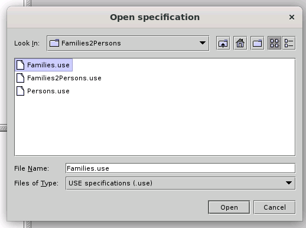

A successful model load should look like this:

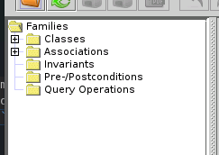

2. After the source model is successfully loaded, you will have to load target model and transformation rule. In this example, the target model is `Persons`, with the same logic, it should be specified in `Persons.use` file, and the transformation rule is `F2PForward` which is specified in `F2PForward.tgg` file:

- Select `RTL Parser` button under `Plugins > RTL Plugin` menu:

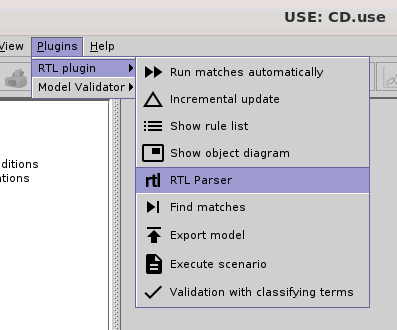

- The target model and rule import interface should look like this:

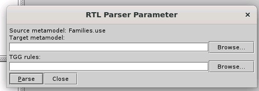

- Hit `Browse` button next to `Target metamodel` textbox to choose target model file, choose `Persons.use` from popped up dialog:

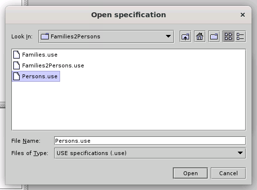

- Hit `Browse` button next to `TGG rules` textbox to choose the transformation rules file, choose `F2PForward.tgg` from popped up dialog:

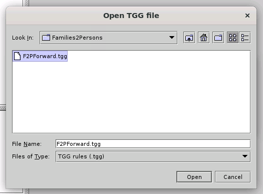

- Hit `Parse` button to parse target model and transformation rule, a successful load will look like this:

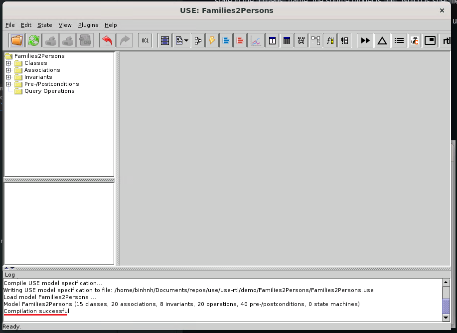

### Viewing rules and objects

After a successful load, we would like to see what have happended, the transformation rule, constraints, etc.

1. Metamodels (classes) view consists of metamodels from source model, target model and transformation. To create this view:

- Select `Class diagram` under `View > Create View` menu:

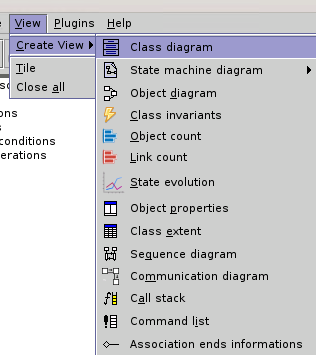

- This view can start a little messy, be patient, expand the view's window and drag components around for better observation. The view can be as good as this:

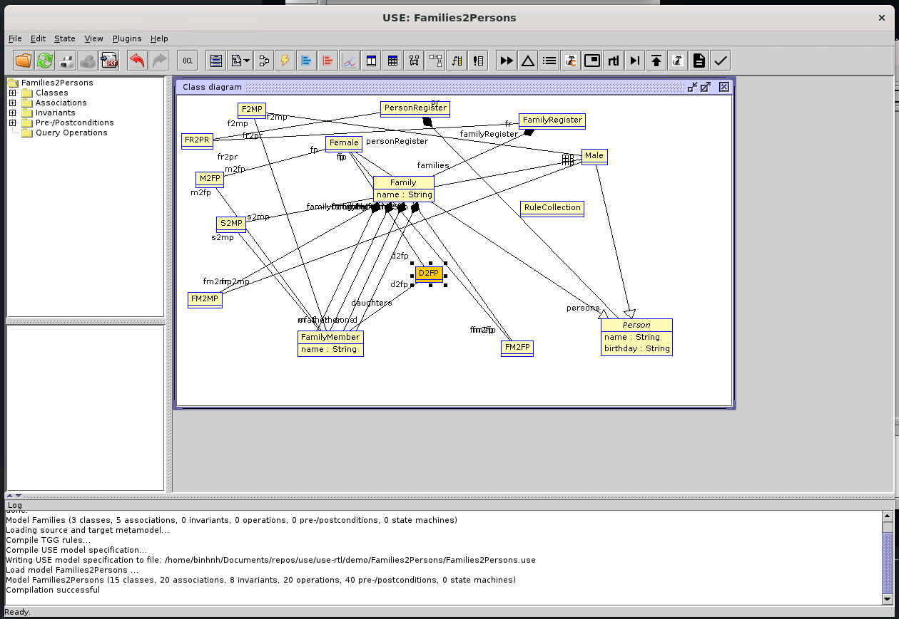

Transformations or associations (such as FR2PR, M2FP), are also presented as class in this view.

2. Object view consists of actual object in our specification, objects only live in runtime, so we have to insert some later. To create this view:

- Select `Object view` under `View > Create View` menu:

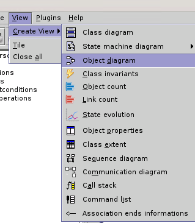

- As I did mention earlier, objects only live in runtime, so without any construction, the object view has only one `RuleCollection` object which represents all transformation rules:

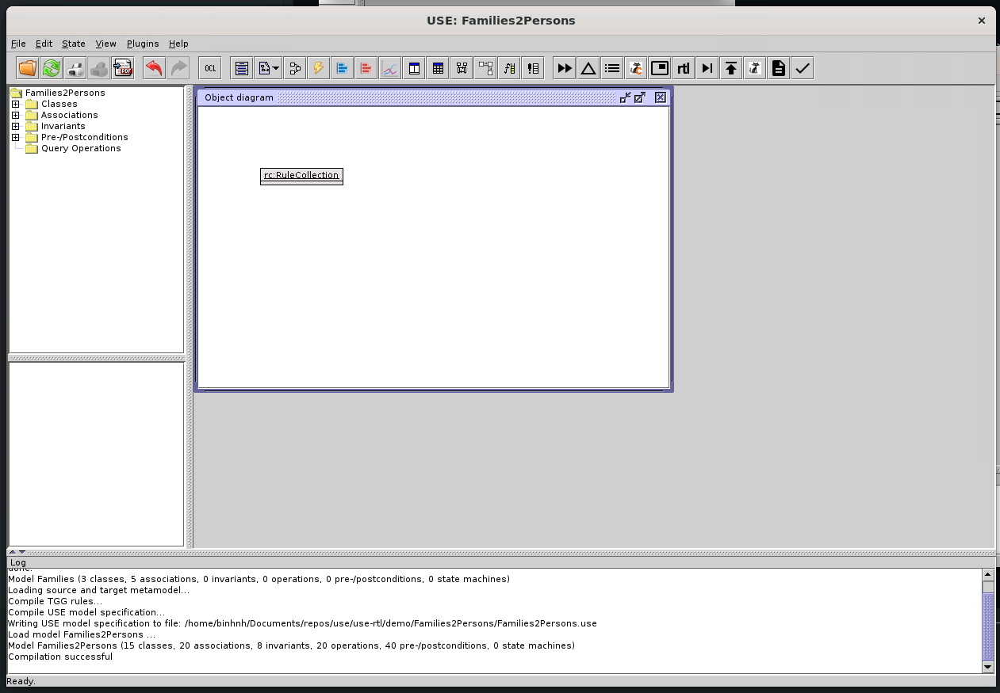

- To create objects for better visualization, go back to the terminal where you started USE application, you may notice USE command line interface also started, and is waiting for command. Yes, you can use USE from terminal. From here, we will construct objects from `.soil` file:
  - First, we have to find the absolute path of `input01.soil` file inside `Families2Persons/`, let's say you are at the root of USE project:
  ```sh
  $ readlink -f ./use-rtl/examples/Families2Persons/input01.soil
  ```
  - Copy the result of above command, let's call it the `%ABSOLUTE_PATH%`, now open the USE shell and type:
  ```sh
  use> open %ABSOLUTE_PATH%
  ```
- If the USE shell yields those lines, you have successfully created objects:

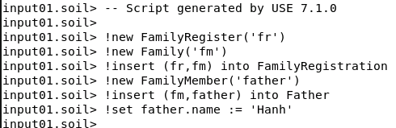

- Now, go back to USE GUI, you can see your created object view has changed, if it disappeared, create a new one. New object view now has new objects:

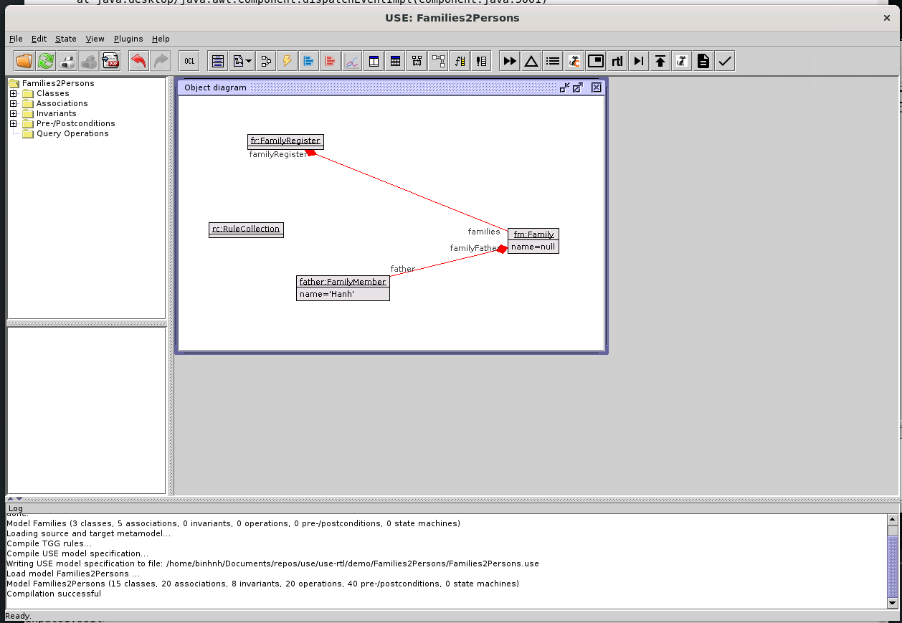

The object view now has a `father` object, which is a `Family`'s father. But wait, there's neither person nor transformation yet. Let's execute transformation.

3. Transformations are executed on rule-matched object. To execute transformation:

- Select `Find matches` under `Plugins > RTL plugin` menu:

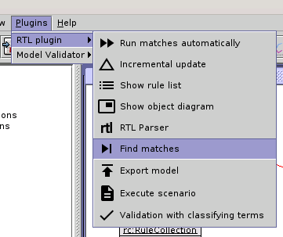

- Select `Run matches automatically` under `Plugins > RTL plugin` menu:

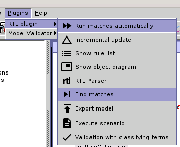

- A successful transformation should look like this:

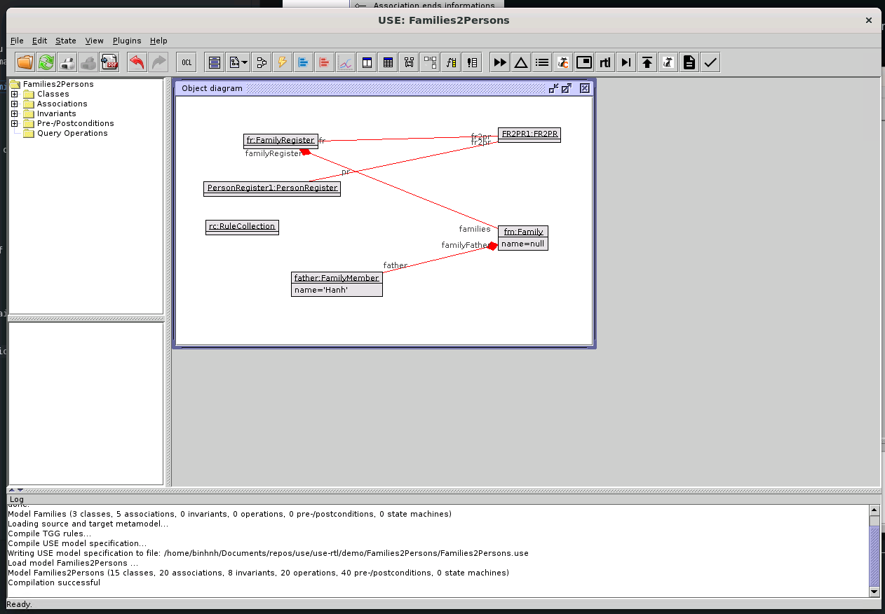

4. Sometimes, we want to view the rule in a visualized way, not that eye hurting rule as code form. To view the rules:

- Select `Show rule list` under `Plugins > RTL plugin` menu:

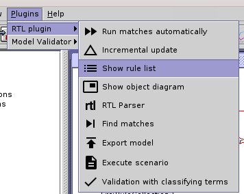

- A rule list window should appear:

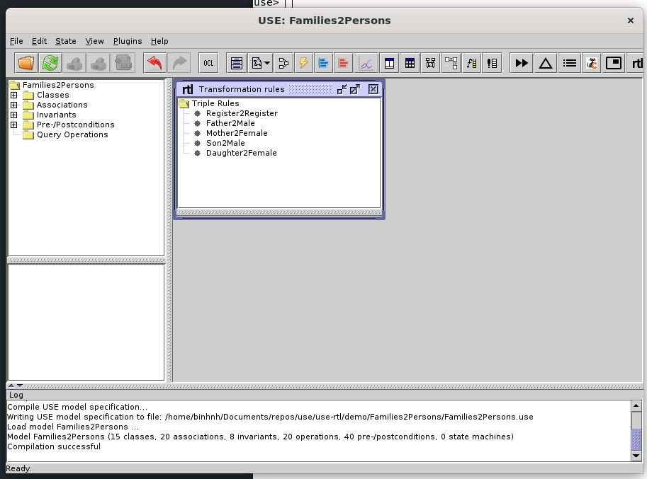

- Select a rule to view, in this example I will select `Father2Male` rule:

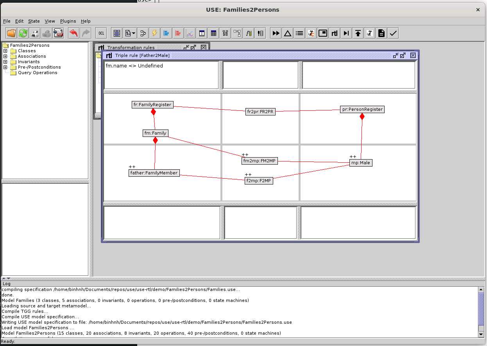

The UI is misaligned at first, but just like the class diagram, you can drag components around, in this case including the panels' dividers to make it as good as above image.

- The rule view consists of multiple regions:
  - The OCL constraint panels:
    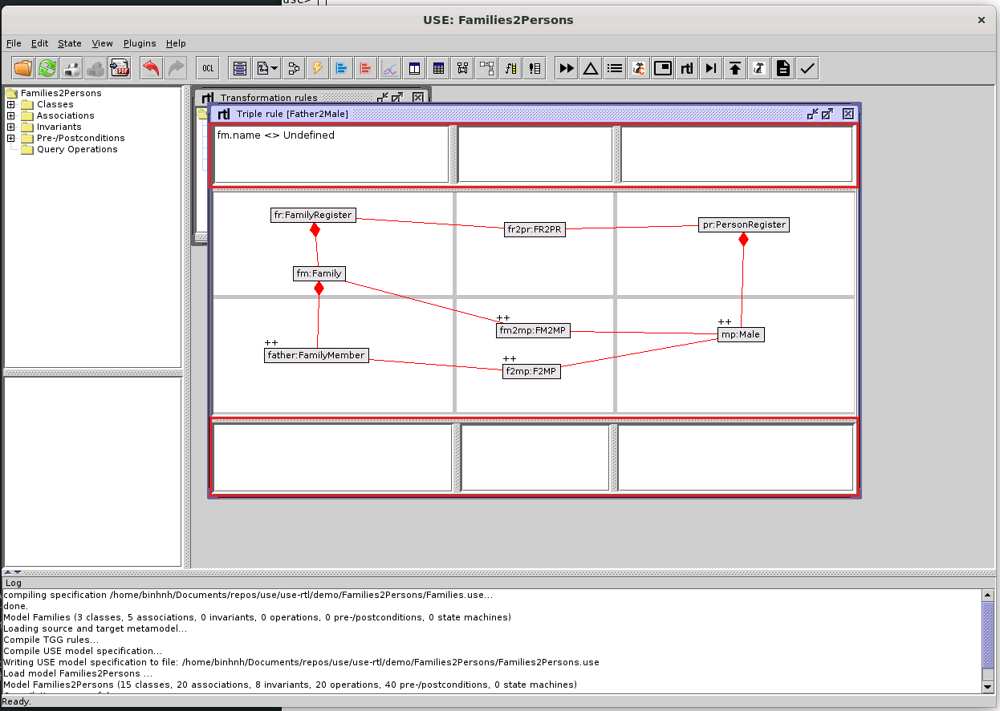
  - The source graph panels:
    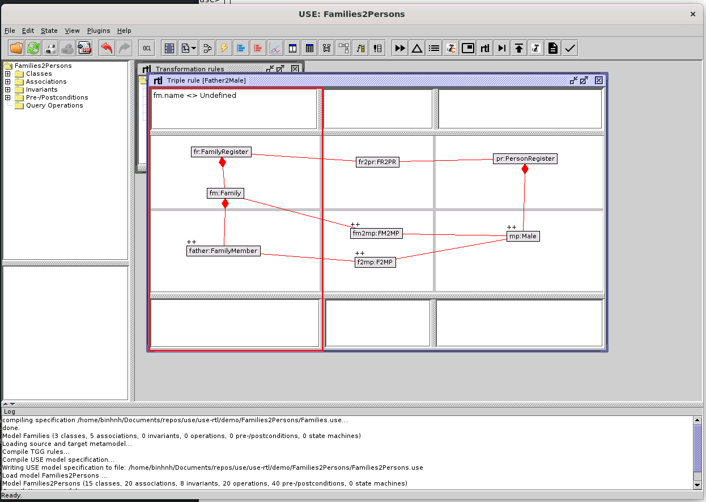
  - The correspondence graph panels:
    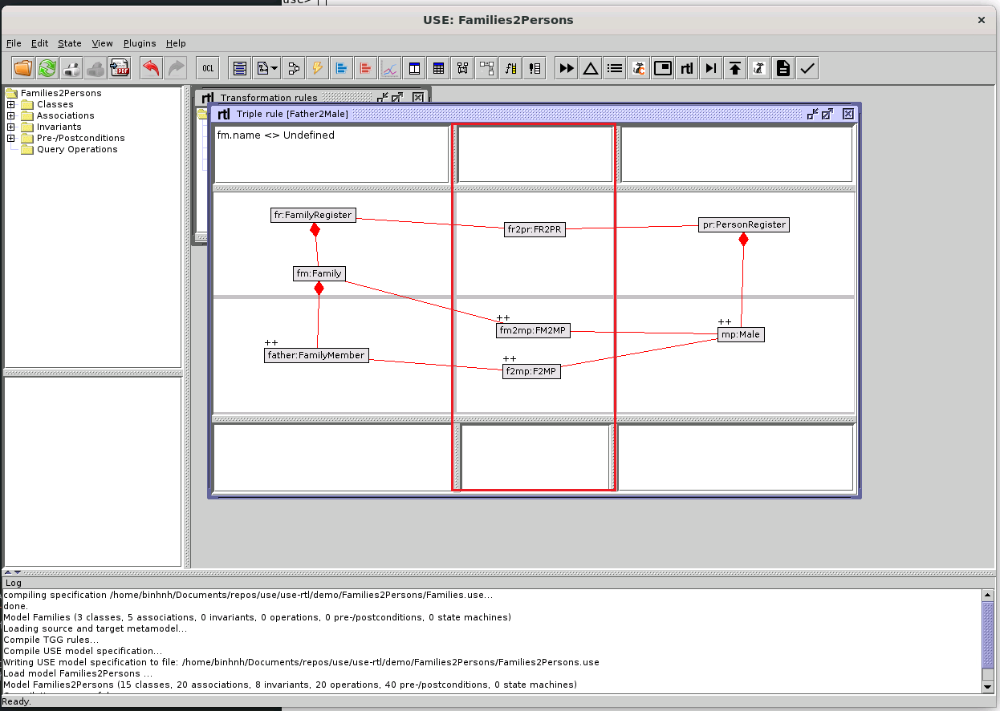
  - The target graph panels:
    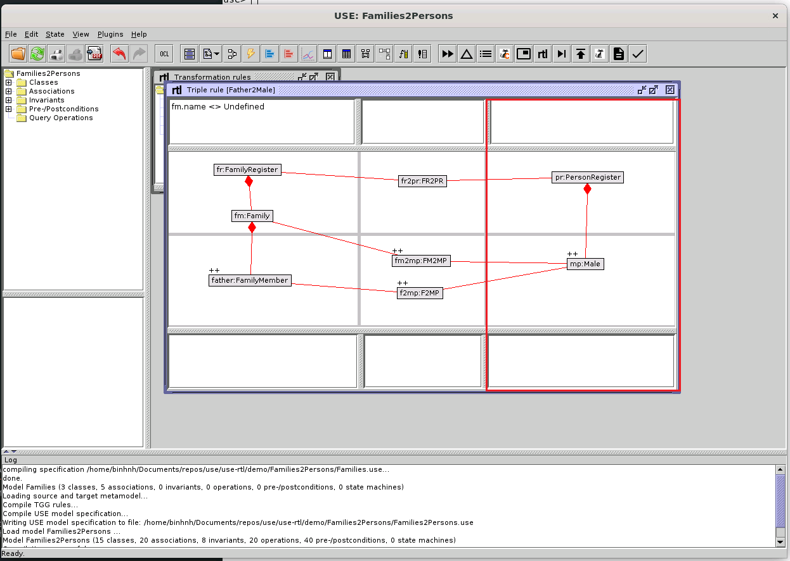
  - The left-hand side expression panels:
    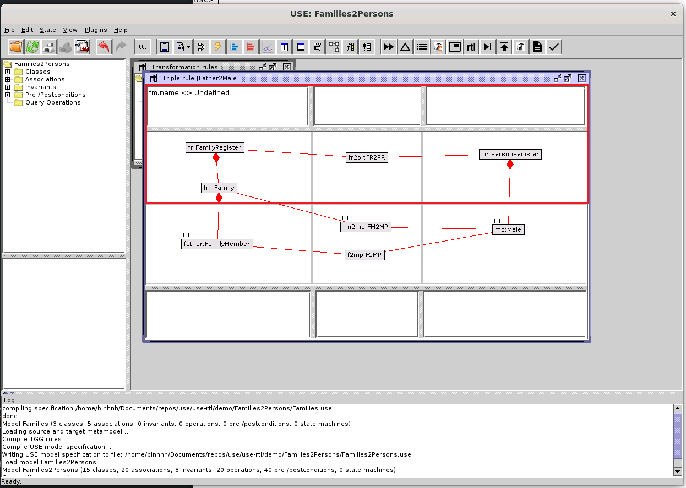
  - The right-hand side expression panels:
    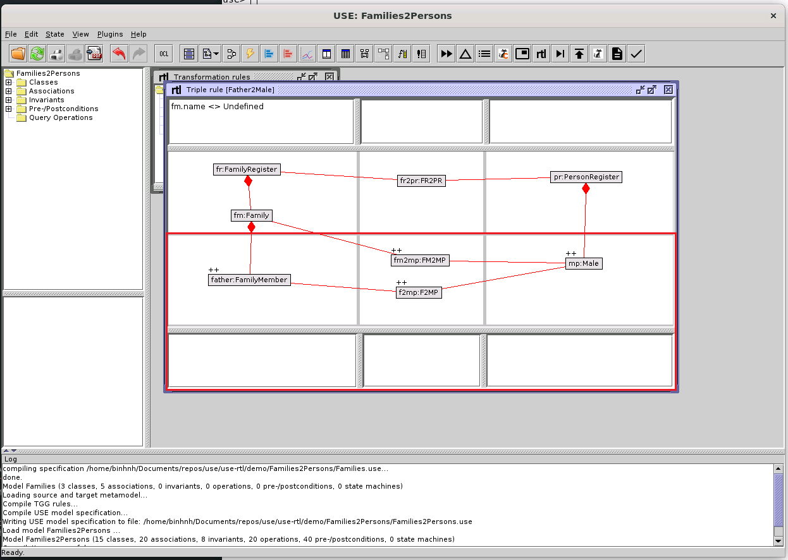
    
For the meaning of each region, please refer to knowledge base of RTL.
